# 🌟 Paper List for Prototypical Learning - [Junhao Jia](https://BeistMedAI.github.io/)

  

 
  

**🦉 Contributors: [Junhao Jia (23' HDU Undergraduate)](https://github.com/BeistMedAI), [Yifei Sun (22' HDU-ITMO Undergraduate)](https://diaoquesang.github.io/), [Shuo Jiang (23' HDU Undergraduate)](https://github.com/JSLiam94), [Hanwen Zheng (23' HDU Undergraduate)](https://github.com/Zhenghanwen-zhw), [Yuting Shi (23' HDU Undergraduate)](https://github.com/sytttttttt)**

### Welcome to join us by contacting: 23080631@hdu.edu.cn.

*: *Papers for Non-Medical Prototypical Learning*

## 🕐 1. The origin of prototypical learning 

- [[NeurIPS 2017]](https://proceedings.neurips.cc/paper_files/paper/2017/file/cb8da6767461f2812ae4290eac7cbc42-Paper.pdf) **Prototypical networks for few-shot learning**

<pre>
@article{snell2017prototypical,
  title={Prototypical networks for few-shot learning},
  author={Snell, Jake and Swersky, Kevin and Zemel, Richard},
  journal={Advances in neural information processing systems},
  volume={30},
  year={2017}
}
</pre>

https://github.com/jakesnell/prototypical-networks

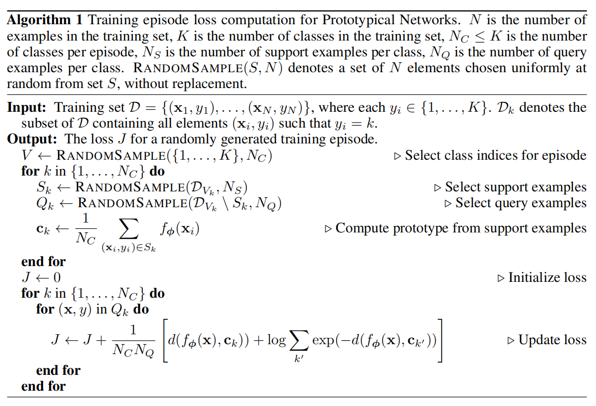

## 🕑 2.  Some follow-up studies introduce the idea of prototypical learning for model interpretation in image classification

- [[NeurIPS 2019]](https://proceedings.neurips.cc/paper/2019/file/adf7ee2dcf142b0e11888e72b43fcb75-Paper.pdf) **This looks like that: deep learning for interpretable image recognition**

<pre>
@article{chen2019looks,
  title={This looks like that: deep learning for interpretable image recognition},
  author={Chen, Chaofan and Li, Oscar and Tao, Daniel and Barnett, Alina and Rudin, Cynthia and Su, Jonathan K},
  journal={Advances in neural information processing systems},
  volume={32},
  year={2019}
}
</pre>

https://github.com/cfchen-duke/ProtoPNet

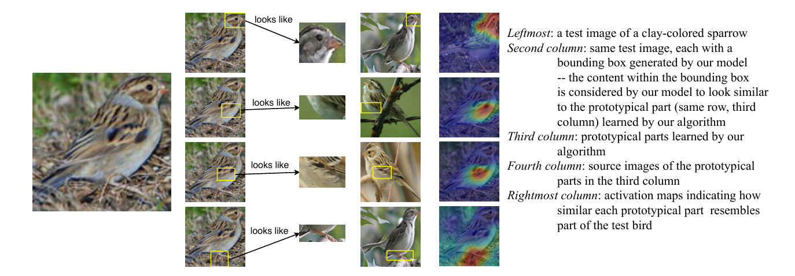

- [[ICCV 2023]](https://openaccess.thecvf.com/content/ICCV2023/papers/Wang_Learning_Support_and_Trivial_Prototypes_for_Interpretable_Image_Classification_ICCV_2023_paper.pdf) **Learning support and trivial prototypes for interpretable image classification**

<pre>
@inproceedings{wang2023learning,
  title={Learning support and trivial prototypes for interpretable image classification},
  author={Wang, Chong and Liu, Yuyuan and Chen, Yuanhong and Liu, Fengbei and Tian, Yu and McCarthy, Davis and Frazer, Helen and Carneiro, Gustavo},
  booktitle={Proceedings of the IEEE/CVF International Conference on Computer Vision},
  pages={2062--2072},
  year={2023}
}
</pre>

未开源

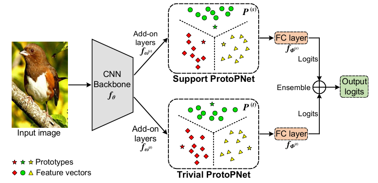

## 🕒 3. Some works extend to use pixel-wise prototypes for improving the transparency of semantic segmentation models

- [[CVPR 2022]](https://openaccess.thecvf.com/content/CVPR2022/papers/Zhou_Rethinking_Semantic_Segmentation_A_Prototype_View_CVPR_2022_paper.pdf) **Rethinking semantic segmentation: A prototype view**

<pre>
@inproceedings{zhou2022rethinking,
  title={Rethinking semantic segmentation: A prototype view},
  author={Zhou, Tianfei and Wang, Wenguan and Konukoglu, Ender and Van Gool, Luc},
  booktitle={Proceedings of the IEEE/CVF conference on computer vision and pattern recognition},
  pages={2582--2593},
  year={2022}
}
</pre>

https://github.com/tfzhou/ProtoSeg

  
- [[WACV 2023]](https://openaccess.thecvf.com/content/WACV2023/papers/Sacha_ProtoSeg_Interpretable_Semantic_Segmentation_With_Prototypical_Parts_WACV_2023_paper.pdf) **Protoseg: Interpretable semantic segmentation with prototypical parts**

<pre>
@inproceedings{sacha2023protoseg,
  title={Protoseg: Interpretable semantic segmentation with prototypical parts},
  author={Sacha, Miko{\l}aj and Rymarczyk, Dawid and Struski, {\L}ukasz and Tabor, Jacek and Zieli{\'n}ski, Bartosz},
  booktitle={Proceedings of the IEEE/CVF Winter Conference on Applications of Computer Vision},
  pages={1481--1492},
  year={2023}
}
</pre>

https://github.com/gmum/proto-segmentation

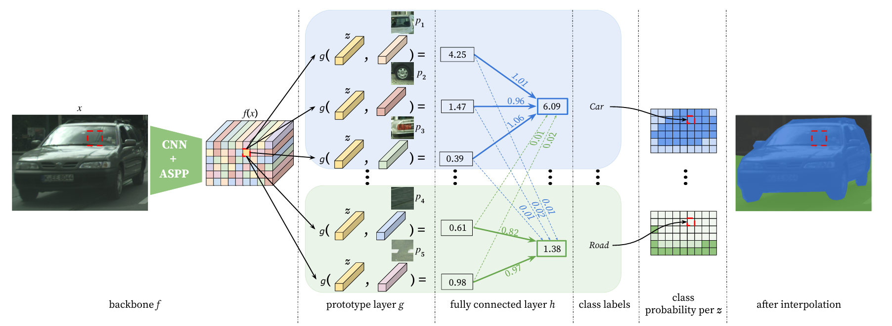

- [[WACV 2025]](https://ieeexplore.ieee.org/abstract/document/10943616) **Multi-Scale Grouped Prototypes for Interpretable Semantic Segmentation**

<pre>
@inproceedings{porta2025multi,
  title={Multi-Scale Grouped Prototypes for Interpretable Semantic Segmentation},
  author={Porta, Hugo and Dalsasso, Emanuele and Marcos, Diego and Tuia, Devis},
  booktitle={2025 IEEE/CVF Winter Conference on Applications of Computer Vision (WACV)},
  pages={2869--2880},
  year={2025},
  organization={IEEE}
}
</pre>

https://github.com/eceo-epfl/ScaleProtoSeg

## 🕒 4. Non-parametric Part Prototype Learning

- [[arXiv 2025]](https://arxiv.org/pdf/2503.10247) **Interpretable Image Classification via Non-parametric Part Prototype Learning**

<pre>
@inproceedings{zhou2022rethinking,
  title={Rethinking semantic segmentation: A prototype view},
  author={Zhou, Tianfei and Wang, Wenguan and Konukoglu, Ender and Van Gool, Luc},
  booktitle={Proceedings of the IEEE/CVF conference on computer vision and pattern recognition},
  pages={2582--2593},
  year={2022}
}
</pre>

https://github.com/zijizhu/proto-non-param

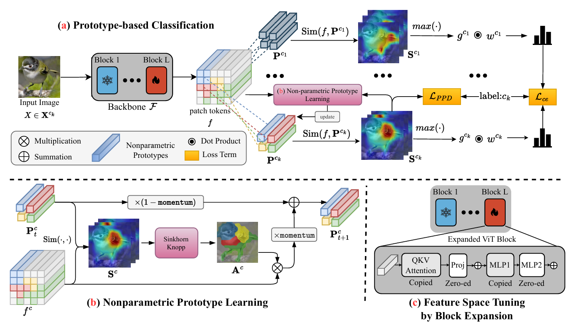

## 🕒 5. Pixel-grounded prototypical part networks

- [[WACV 2024]](https://openaccess.thecvf.com/content/WACV2024/papers/Carmichael_Pixel-Grounded_Prototypical_Part_Networks_WACV_2024_paper.pdf) **Pixel-grounded prototypical part networks**

<pre>
@inproceedings{carmichael2024pixel,
  title={Pixel-grounded prototypical part networks},
  author={Carmichael, Zachariah and Lohit, Suhas and Cherian, Anoop and Jones, Michael J and Scheirer, Walter J},
  booktitle={Proceedings of the IEEE/CVF Winter Conference on Applications of Computer Vision},
  pages={4768--4779},
  year={2024}
}
</pre>

https://github.com/merlresearch/PixPNet

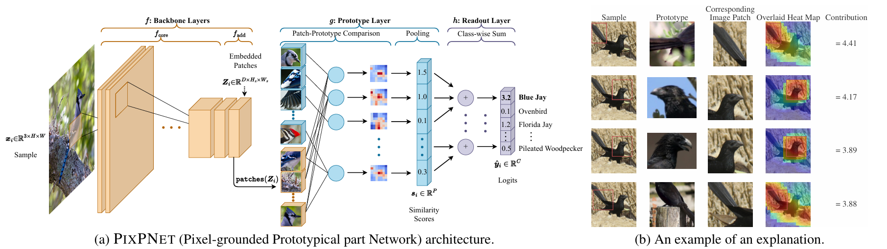

## 🕒 5. Adaptive Prototype-based Vision Transformers

- [[NeurIPS 2024]](https://proceedings.neurips.cc/paper_files/paper/2024/file/48dfc849640344e2d58df0b5bb78c33b-Paper-Conference.pdf) **Interpretable Image Classification with Adaptive Prototype-based Vision Transformers**

<pre>
@inproceedings{carmichael2024pixel,
  title={Pixel-grounded prototypical part networks},
  author={Carmichael, Zachariah and Lohit, Suhas and Cherian, Anoop and Jones, Michael J and Scheirer, Walter J},
  booktitle={Proceedings of the IEEE/CVF Winter Conference on Applications of Computer Vision},
  pages={4768--4779},
  year={2024}
}
</pre>

https://github.com/Henrymachiyu/ProtoViT

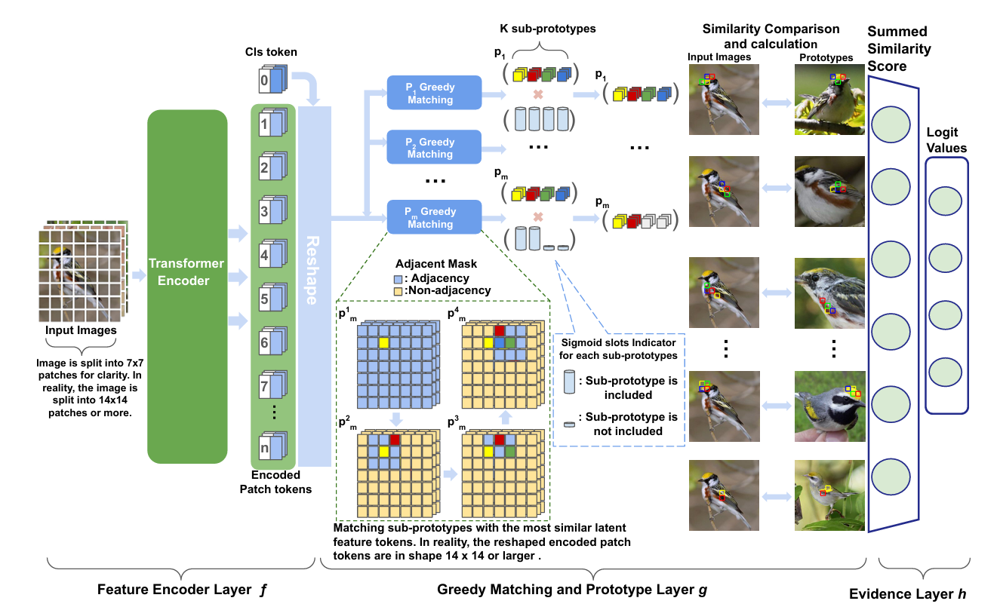

## 🕒 6. Multi-level concept prototypes

- [[CVPR 2024]](https://openaccess.thecvf.com/content/CVPR2024/papers/Wang_MCPNet_An_Interpretable_Classifier_via_Multi-Level_Concept_Prototypes_CVPR_2024_paper.pdf) **Mcpnet: An interpretable classifier via multi-level concept prototypes**

<pre>
@inproceedings{wang2024mcpnet,
  title={Mcpnet: An interpretable classifier via multi-level concept prototypes},
  author={Wang, Bor-Shiun and Wang, Chien-Yi and Chiu, Wei-Chen},
  booktitle={Proceedings of the IEEE/CVF Conference on Computer Vision and Pattern Recognition},
  pages={10885--10894},
  year={2024}
}
</pre>

https://github.com/NVlabs/MCPNet

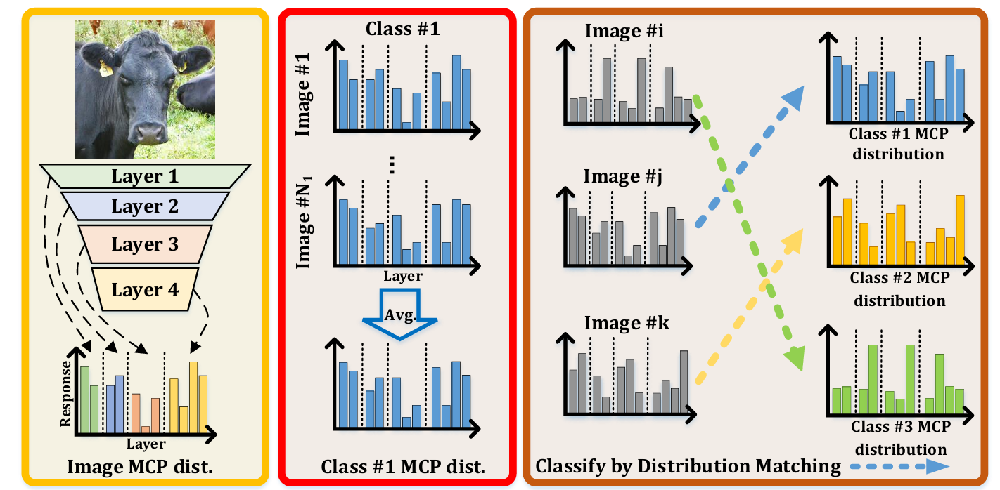

## 🕒 7. Invertible Prototypical Network

- [[ECCV 2024]](https://arxiv.org/pdf/2407.12200) **This Probably Looks Exactly Like That: An Invertible Prototypical Network**

<pre>
@inproceedings{carmichael2024probably,
  title={This probably looks exactly like that: An invertible prototypical network},
  author={Carmichael, Zachariah and Redgrave, Timothy and Cedre, Daniel Gonzalez and Scheirer, Walter J},
  booktitle={European Conference on Computer Vision},
  pages={221--240},
  year={2024},
  organization={Springer}
}
</pre>

https://github.com/craymichael/ProtoFlow

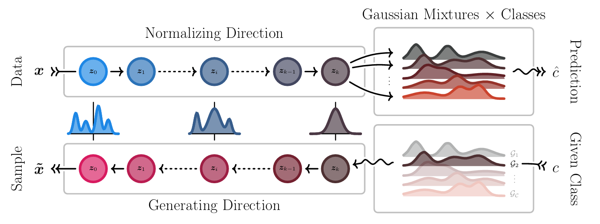

## 🕐 1. Diabetic retinopathy grading

- [[MICCAI 2022]](https://arxiv.org/pdf/2208.00457) **INSightR-Net: interpretable neural network for regression using similarity-based comparisons to prototypical examples**

<pre>
@inproceedings{hesse2022insightr,
  title={INSightR-Net: interpretable neural network for regression using similarity-based comparisons to prototypical examples},
  author={Hesse, Linde S and Namburete, Ana IL},
  booktitle={International Conference on Medical Image Computing and Computer-Assisted Intervention},
  pages={502--511},
  year={2022},
  organization={Springer}
}
</pre>

https://github.com/lindehesse/INSightR-Net

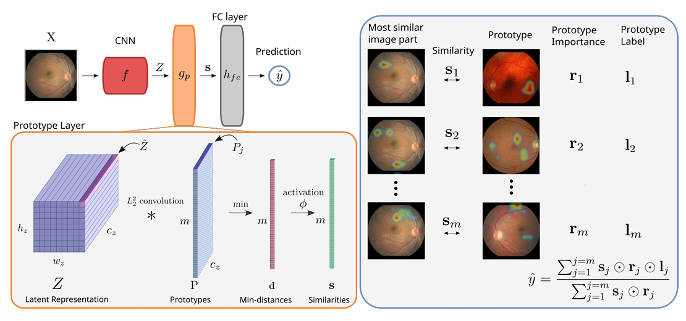

## 🕑 2.  Breast cancer screening

- [[MICCAI 2022]](https://arxiv.org/pdf/2209.12420) **Knowledge distillation to ensemble global and interpretable prototype-based mammogram classification models**

<pre>
@inproceedings{wang2022knowledge,
  title={Knowledge distillation to ensemble global and interpretable prototype-based mammogram classification models},
  author={Wang, Chong and Chen, Yuanhong and Liu, Yuyuan and Tian, Yu and Liu, Fengbei and McCarthy, Davis J and Elliott, Michael and Frazer, Helen and Carneiro, Gustavo},
  booktitle={International Conference on Medical Image Computing and Computer-Assisted Intervention},
  pages={14--24},
  year={2022},
  organization={Springer}
}
</pre>

未开源

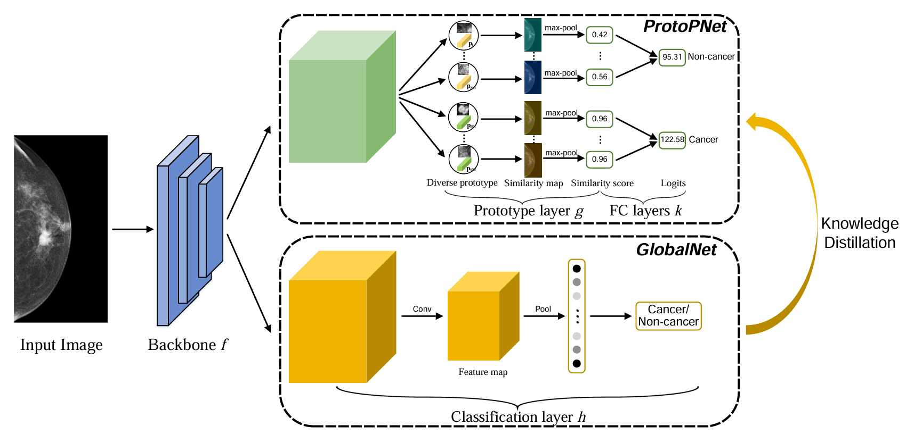

- [[TMI 2023]](https://ieeexplore.ieee.org/stamp/stamp.jsp?tp=&arnumber=10225391) **An Interpretable and Accurate Deep-Learning Diagnosis Framework Modeled With Fully and Semi-Supervised Reciprocal Learning**

<pre>
@article{wang2023interpretable,
  title={An Interpretable and Accurate Deep-Learning Diagnosis Framework Modeled With Fully and Semi-Supervised Reciprocal Learning},
  author={Wang, Chong and Chen, Yuanhong and Liu, Fengbei and Elliott, Michael and Kwok, Chun Fung and Pena-Solorzano, Carlos and Frazer, Helen and McCarthy, Davis James and Carneiro, Gustavo},
  journal={IEEE transactions on medical imaging},
  volume={43},
  number={1},
  pages={392--404},
  year={2023},
  publisher={IEEE}
}
</pre>

未开源

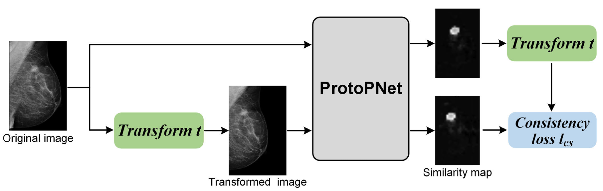

## 🕒 3.  Alzheimer’s disease detection

- [[IPMI 2023]](https://arxiv.org/pdf/2303.07125) **Don't panic: Prototypical additive neural network for interpretable classification of alzheimer's disease**

<pre>
@inproceedings{wolf2023don,
  title={Don’t panic: Prototypical additive neural network for interpretable classification of alzheimer’s disease},
  author={Wolf, Tom Nuno and P{\"o}lsterl, Sebastian and Wachinger, Christian},
  booktitle={International Conference on Information Processing in Medical Imaging},
  pages={82--94},
  year={2023},
  organization={Springer}
}
</pre>

https://github.com/ai-med/PANIC

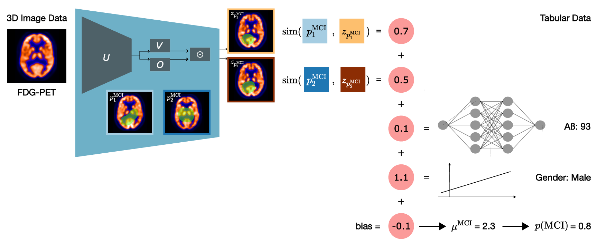

## 🕒 4.  Uncertainty-aware aortic stenosis classification in echocardiography

- [[MICCAI 2023]](https://arxiv.org/pdf/2307.14433) **ProtoASNet: Dynamic Prototypes for Inherently  Interpretable and Uncertainty-Aware Aortic  Stenosis Classification in Echocardiography**

<pre>
@inproceedings{vaseli2023protoasnet,
  title={Protoasnet: Dynamic prototypes for inherently interpretable and uncertainty-aware aortic stenosis classification in echocardiography},
  author={Vaseli, Hooman and Gu, Ang Nan and Ahmadi Amiri, S Neda and Tsang, Michael Y and Fung, Andrea and Kondori, Nima and Saadat, Armin and Abolmaesumi, Purang and Tsang, Teresa SM},
  booktitle={International conference on medical image computing and computer-assisted intervention},
  pages={368--378},
  year={2023},
  organization={Springer}
}
</pre>

https://github.com/hooman007/ProtoASNet

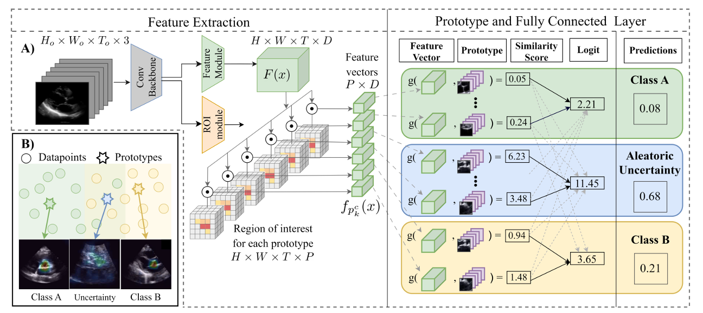

- [[MedIA 2025]](https://www.sciencedirect.com/science/article/pii/S1361841525001471) **ProtoASNet: Comprehensive evaluation and enhanced performance with uncertainty estimation for Aortic stenosis classification in echocardiography**

<pre>
@article{gu2025protoasnet,
  title={ProtoASNet: Comprehensive evaluation and enhanced performance with uncertainty estimation for Aortic stenosis classification in echocardiography},
  author={Gu, Ang Nan and Vaseli, Hooman and Tsang, Michael Y and Wu, Victoria and Amiri, S Neda Ahmadi and Kondori, Nima and Fung, Andrea and Tsang, Teresa SM and Abolmaesumi, Purang},
  journal={Medical Image Analysis},
  pages={103600},
  year={2025},
  publisher={Elsevier}
}
</pre>

https://github.com/hooman007/ProtoASNet

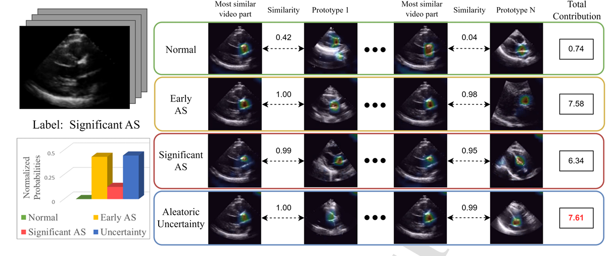

## 🕒 5.  Hierarchical prototypes to handle the complexity of lesions in medical images

- [[JBHI 2025]](https://ieeexplore.ieee.org/abstract/document/10955117) *Progressive Mining and Dynamic Distillation of Hierarchical Prototypes for Disease Classification and Localisation**

<pre>
@article{wang2025progressive,
  title={Progressive Mining and Dynamic Distillation of Hierarchical Prototypes for Disease Classification and Localisation},
  author={Wang, Chong and Liu, Fengbei and Chen, Yuanhong and Kwok, Chun Fung and Elliott, Michael and Pena-Solorzano, Carlos and McCarthy, Davis James and Frazer, Helen and Carneiro, Gustavo},
  journal={IEEE Journal of Biomedical and Health Informatics},
  year={2025},
  publisher={IEEE}
}
</pre>

未开源

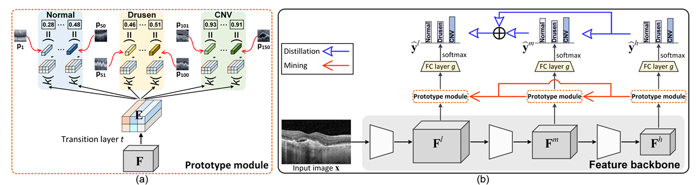

## 🕒 6.  Prototypes for Multi-label Disease Diagnosis

- [[TMI 2025]](https://ieeexplore.ieee.org/abstract/document/10887396) *Cross-and Intra-image Prototypical Learning for Multi-label Disease Diagnosis and Interpretation**

<pre>
@article{wang2025cross,
  title={Cross-and Intra-image Prototypical Learning for Multi-label Disease Diagnosis and Interpretation},
  author={Wang, Chong and Liu, Fengbei and Chen, Yuanhong and Frazer, Helen and Carneiro, Gustavo},
  journal={IEEE Transactions on Medical Imaging},
  year={2025},
  publisher={IEEE}
}
</pre>

https://github.com/cwangrun/CIPL

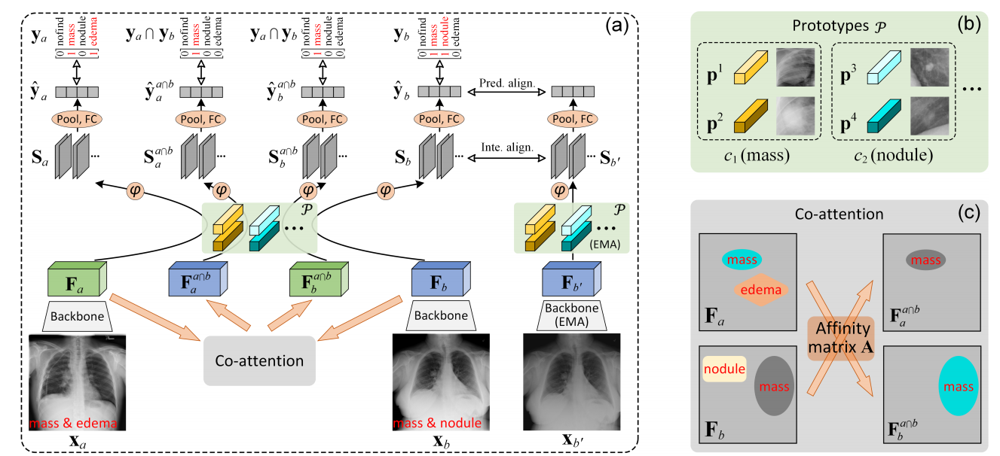

## 🕒 7.  Characteristic discriminative prototype network with detailed interpretation for classification

- [[PR 2025]](https://www.sciencedirect.com/science/article/pii/S0031320324006526) *Characteristic discriminative prototype network with detailed interpretation for classification**

<pre>
@article{wen2025characteristic,
  title={Characteristic discriminative prototype network with detailed interpretation for classification},
  author={Wen, Jiajun and Kong, Heng and Lai, Zhihui and Zhu, Zhijie},
  journal={Pattern Recognition},
  volume={157},
  pages={110901},
  year={2025},
  publisher={Elsevier}
}
</pre>

未开源

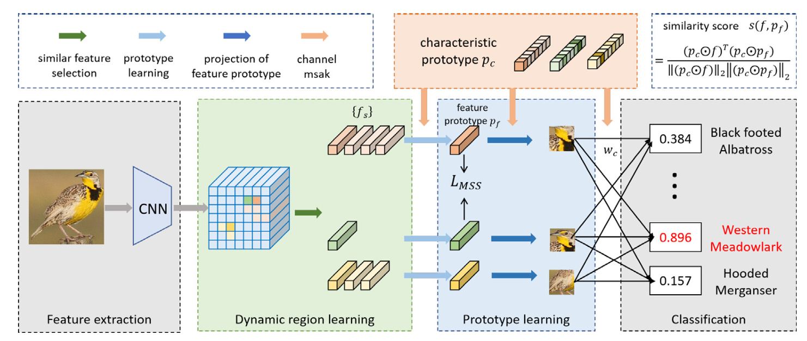

*: *Papers for Prototypical Learning (AAAI)*

- [AAAI 2025] **ProtoArgNet: Interpretable Image Classification with Super-Prototypes and Argumentation**

<pre>
@inproceedings{ayoobi2025protoargnet,
  title={ProtoArgNet: Interpretable Image Classification with Super-Prototypes and Argumentation},
  author={Ayoobi, Hamed and Potyka, Nico and Toni, Francesca},
  booktitle={Proceedings of the AAAI Conference on Artificial Intelligence},
  volume={39},
  number={2},
  pages={1791--1799},
  year={2025}
}
</pre>

https://github.com/H-Ayoobi/ProtoArgNet_AAAI

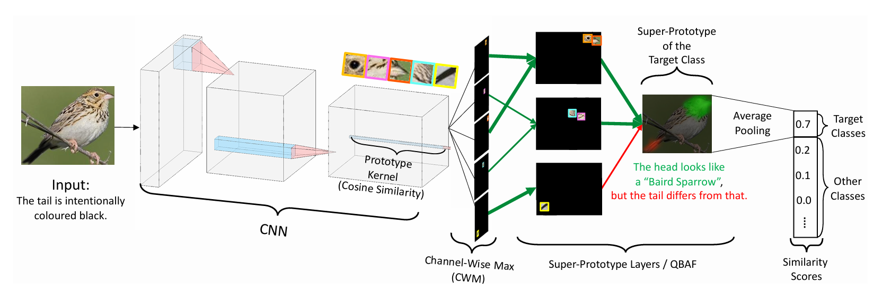

- [AAAI 2024] **Interpretability benchmark for evaluating spatial misalignment of prototypical parts explanations**

<pre>
@inproceedings{sacha2024interpretability,
  title={Interpretability benchmark for evaluating spatial misalignment of prototypical parts explanations},
  author={Sacha, Miko{\l}aj and Jura, Bartosz and Rymarczyk, Dawid and Struski, {\L}ukasz and Tabor, Jacek and Zieli{\'n}ski, Bartosz},
  booktitle={Proceedings of the AAAI Conference on Artificial Intelligence},
  volume={38},
  number={19},
  pages={21563--21573},
  year={2024}
}
</pre>

https://github.com/gmum/interpretability-benchmark

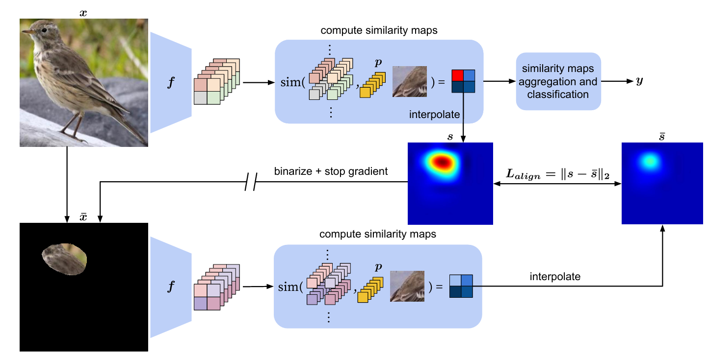

## 🥰 Star History

