# 🌟 Paper List for Prototypical Learning - [Junhao Jia](https://BeistMedAI.github.io/)

  

 
  

**🦉 Contributors: [Junhao Jia (23' HDU Undergraduate)](https://github.com/BeistMedAI), [Yifei Sun (22' HDU-ITMO Undergraduate)](https://diaoquesang.github.io/), [Shuo Jiang (23' HDU Undergraduate)](https://github.com/JSLiam94), [Hanwen Zheng (23' HDU Undergraduate)](https://github.com/Zhenghanwen-zhw), [Yuting Shi (23' HDU Undergraduate)](https://github.com/sytttttttt)**

**📦 Other resources: [Paper-List-for-Medical-Anomaly-Detection](https://github.com/diaoquesang/Paper-List-for-Medical-Anomaly-Detection).**

### Welcome to join us by contacting: 23080631@hdu.edu.cn.

## 📇 Contents
- [📚 Overview](#s1)
- [✏️ Tips](#s2)
- [🕐 1. Prototype Learning for Image Classification](#s3)
- [🕑 2. Prototype Learning for Medical Image Classification](#s4)
- [🥰 Star History](#s5)

## 📚 Overview

## ✏️ Tips

- :octocat: : Code
- ⚠️ : Remark

## 🕐 1. Prototype Learning for Image Classification

- [[2017-NIPS]](https://proceedings.neurips.cc/paper_files/paper/2017/file/cb8da6767461f2812ae4290eac7cbc42-Paper.pdf) **Prototypical networks for few-shot learning** [:octocat:](https://github.com/jakesnell/prototypical-networks)

 Abstract 

- [Abstract] We propose Prototypical Networks for the problem of few-shot classification, where a classifier must generalize to new classes not seen in the training set, given only a small number of examples of each new class. Prototypical Networks learn a metric space in which classification can be performed by computing distances to prototype representations of each class. Compared to recent approaches for few-shot learning, they reflect a simpler inductive bias that is beneficial in this limited-data regime, and achieve excellent results. We provide an analysis showing that some simple design decisions can yield substantial improvements over recent approaches involving complicated architectural choices and meta-learning. We further extend Prototypical Networks to zero-shot learning and achieve state-of-the-art results on the CU-Birds dataset.

<pre>
@article{snell2017prototypical,
  title={Prototypical networks for few-shot learning},
  author={Snell, Jake and Swersky, Kevin and Zemel, Richard},
  journal={Advances in neural information processing systems},
  volume={30},
  year={2017}
}
</pre>

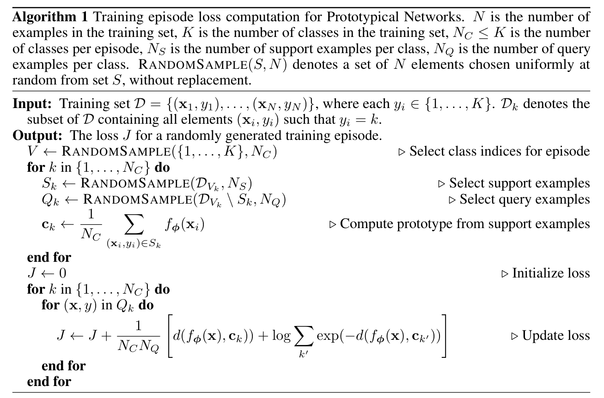

- [[2019-NIPS]](https://proceedings.neurips.cc/paper/2019/file/adf7ee2dcf142b0e11888e72b43fcb75-Paper.pdf) **This looks like that: deep learning for interpretable image recognition** [:octocat:](https://github.com/cfchen-duke/ProtoPNet)

 Abstract 

<pre>
When we are faced with challenging image classification tasks, we often explain
our reasoning by dissecting the image, and pointing out prototypical aspects of
one class or another. The mounting evidence for each of the classes helps us
make our final decision. In this work, we introduce a deep network architecture –
prototypical part network (ProtoPNet), that reasons in a similar way: the network
dissects the image by finding prototypical parts, and combines evidence from the
prototypes to make a final classification. The model thus reasons in a way that is
qualitatively similar to the way ornithologists, physicians, and others would explain
to people on how to solve challenging image classification tasks. The network uses
only image-level labels for training without any annotations for parts of images.
We demonstrate our method on the CUB-200-2011 dataset and the Stanford Cars
dataset. Our experiments show that ProtoPNet can achieve comparable accuracy
with its analogous non-interpretable counterpart, and when several ProtoPNets
are combined into a larger network, it can achieve an accuracy that is on par with
some of the best-performing deep models. Moreover, ProtoPNet provides a level
of interpretability that is absent in other interpretable deep models.
</pre>

 Vocabulary 

<pre>
dissecting : 解剖
ornithologists : 鸟类学家
analogous : 类似的
</pre>

<pre>
@article{chen2019looks,
  title={This looks like that: deep learning for interpretable image recognition},
  author={Chen, Chaofan and Li, Oscar and Tao, Daniel and Barnett, Alina and Rudin, Cynthia and Su, Jonathan K},
  journal={Advances in neural information processing systems},
  volume={32},
  year={2019}
}
</pre>

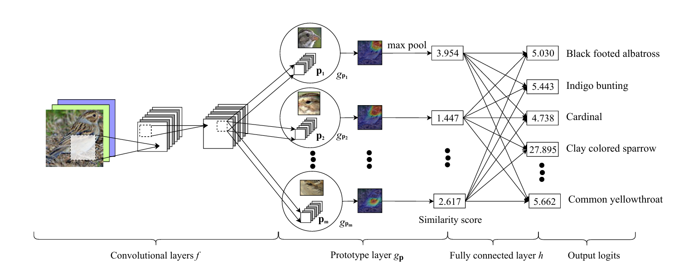

- [[2019-AAAI]](https://ojs.aaai.org/index.php/HCOMP/article/view/5265) **Interpretable Image Recognition with Hierarchical Prototypes** [:octocat:](https://github.com/peterbhase/interpretable-image)

 Abstract 

<pre>
Vision models are interpretable when they classify objects on the basis of features that a person 
can directly understand. 
Recently, methods relying on visual feature prototypes have been developed for this purpose. 
However, in contrast to how humans categorize objects, these approaches have not yet made use of 
any taxonomical organization of class labels.
With such an approach, for instance, we may see why a chimpanzee is classified as a chimpanzee, 
but not why it was considered to be a primate or even an animal. 
In this work we introduce a model that uses hierarchically organized prototypes to classify objects 
at every level in a predefined taxonomy.
Hence, we may find distinct explanations for the prediction an image receives at each level of the taxonomy. 
The hierarchical prototypes enable the model to perform another important task: 
interpretably classifying images from previously unseen classes at the level of the taxonomy to 
which they correctly relate, e.g. classifying a hand gun as a weapon, when the only weapons in the training 
data are rifles. 
With a subset of ImageNet, we test our model against its counterpart black-box model on two tasks: 
1) classification of data from familiar classes, and 
2) classification of data from previously unseen classes at the appropriate level in the taxonomy. 
We find that our model performs approximately as well as its counterpart black-box model while allowing for 
each classification to be interpreted.
</pre>

 Vocabulary 

<pre>
taxonomical : 分类学的
chimpanzee : 黑猩猩
primate : 灵长类动物
</pre>

<pre>
@inproceedings{hase2019interpretable,
  title={Interpretable image recognition with hierarchical prototypes},
  author={Hase, Peter and Chen, Chaofan and Li, Oscar and Rudin, Cynthia},
  booktitle={Proceedings of the AAAI Conference on Human Computation and Crowdsourcing},
  volume={7},
  pages={32--40},
  year={2019}
}
</pre>

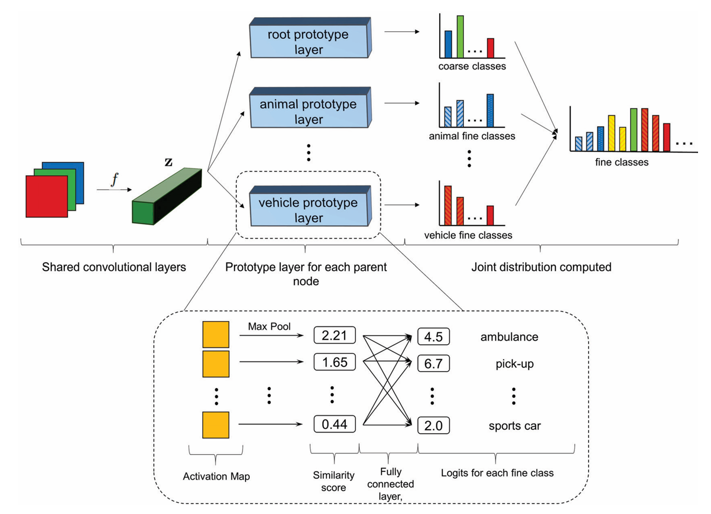

- [[2021-ICML]](https://arxiv.org/pdf/2105.02968) **This Looks Like That... Does it_Shortcomings of Latent Space Prototype Interpretability in Deep Networks** [:octocat:](https://github.com/fanconic/this-does-not-look-like-that)

 Abstract 

<pre>
Deep neural networks that yield human interpretable decisions by architectural design have
become an increasingly popular alternative to posthoc interpretation of traditional black-box models. 
Among these networks, the arguably most widespread approach is so-called prototype learning, 
where similarities to learned latent prototypes serve as the basis of classifying unseen data. 
In this work, we point to a crucial shortcoming of such approaches. 
Namely, there is a semantic gap between similarity in latent space and input space,
which can corrupt interpretability. 
We design two experiments that exemplify this issue on the so-called ProtoPNet. 
We find that its interpretability mechanism can be led astray by crafted noise or
JPEG compression artefacts, which can lead to incoherent decisions. 
We argue that practitioners ought to have this shortcoming in mind when
deploying prototype-based models in practice.
</pre>

 Vocabulary 

<pre>
corrupt : 腐烂
exemplify : 举例说明
astray : 误导
practitioners : 从业人员
</pre>

<pre>
@misc{hoffmann2021looks,
    title={This Looks Like That... Does it? Shortcomings of Latent Space Prototype Interpretability in Deep Networks}, 
    author={Adrian Hoffmann and Claudio Fanconi and Rahul Rade and Jonas Kohler},
    year={2021},
    booktitle={ICML 2021 Workshop on Theoretic Foundation, Criticism, and Application Trend of Explainable AI},
}
</pre>

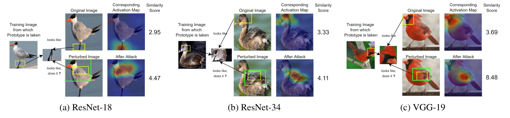

- [[2022-ECCV]](https://arxiv.org/pdf/2112.03184) **HIVE: Evaluating the human interpretability of visual explanations** [:octocat:](https://github.com/princetonvisualai/HIVE)

 Abstract 

<pre>
As AI technology is increasingly applied to high-impact, high-risk domains, 
there have been a number of new methods aimed at making AI models more human interpretable.
Despite the recent growth of interpretability work, there is a lack of systematic evaluation of proposed
techniques. 
In this work, we introduce HIVE (Human Interpretability of Visual Explanations), 
a novel human evaluation framework that assesses the utility of explanations to human users in AI-assisted 
decision making scenarios, and enables falsifiable hypothesis testing, cross-method comparison, 
and human-centered evaluation of visual interpretability methods. 
To the best of our knowledge, this is the first work of its kind. 
Using HIVE, we conduct IRB-approved human studies with nearly 1000 participants and evaluate four methods 
that represent the diversity of computer vision interpretability works: GradCAM, BagNet, ProtoPNet, and ProtoTree.
Our results suggest that explanations engender human trust, even for incorrect predictions, 
yet are not distinct enough for users to distinguish between correct and incorrect predictions. 
We open-source HIVE to enable future studies and encourage more human-centered approaches to interpretability research.
</pre>

 Vocabulary 

<pre>
engender : 产生
</pre>

<pre>
@inproceedings{kim2022hive,
  title={HIVE: Evaluating the human interpretability of visual explanations},
  author={Kim, Sunnie SY and Meister, Nicole and Ramaswamy, Vikram V and Fong, Ruth and Russakovsky, Olga},
  booktitle={European Conference on Computer Vision},
  pages={280--298},
  year={2022},
  organization={Springer}
}
</pre>

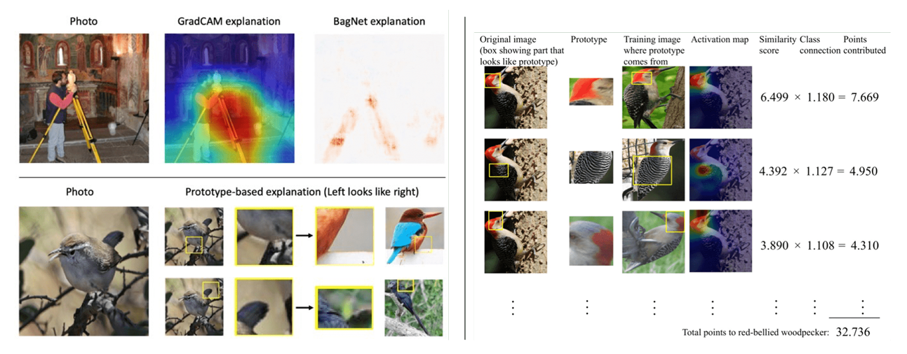

- [[2022-ECCV]](https://arxiv.org/pdf/2112.02902) **Interpretable image classification with differentiable prototypes assignment** [:octocat:](https://github.com/gmum/ProtoPool)

 Abstract 

<pre>
Existing prototypical-based models address the black-box nature of deep learning. 
However, they are sub-optimal as they often assume separate prototypes for each class, require multi-step 
optimization, make decisions based on prototype absence (so-called negative reasoning process), 
and derive vague prototypes. 
To address those shortcomings, we introduce ProtoPool, an interpretable prototype-based model with
positive reasoning and three main novelties. 
Firstly, we reuse prototypes in classes, which significantly decreases their number. 
Secondly, we allow automatic, fully differentiable assignment of prototypes to classes, which
substantially simplifies the training process. 
Finally, we propose a new focal similarity function that contrasts the prototype from the background
and consequently concentrates on more salient visual features. 
We show that ProtoPool obtains state-of-the-art accuracy on the CUB-200-2011
and the Stanford Cars datasets, substantially reducing the number of prototypes. 
We provide a theoretical analysis of the method and a user study to show that our prototypes capture 
more salient features than those obtained with competitive methods.
</pre>

 Vocabulary 

<pre>
derive : 推导
vague : 模糊的
</pre>

<pre>
@inproceedings{rymarczyk2022interpretable,
  title={Interpretable image classification with differentiable prototypes assignment},
  author={Rymarczyk, Dawid and Struski, {\L}ukasz and G{\'o}rszczak, Micha{\l} and Lewandowska, Koryna and Tabor, Jacek and Zieli{\'n}ski, Bartosz},
  booktitle={European Conference on Computer Vision},
  pages={351--368},
  year={2022},
  organization={Springer}
}
</pre>

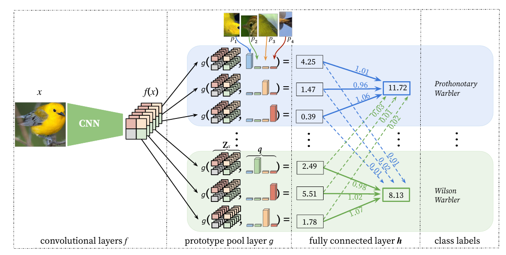

- [[2023-CVPR]](https://openaccess.thecvf.com/content/CVPR2023/papers/Nauta_PIP-Net_Patch-Based_Intuitive_Prototypes_for_Interpretable_Image_Classification_CVPR_2023_paper.pdf) **Pip-net: Patch-based intuitive prototypes for interpretable image classification** [:octocat:](https://github.com/M-Nauta/PIPNet)

 Abstract 

<pre>
Interpretable methods based on prototypical patches recognize various components in an image 
in order to explain their reasoning to humans. 
However, existing prototype-based methods can learn prototypes that are not in line with human visual 
perception, i.e., the same prototype can refer to different concepts in the real world, making 
interpretation not intuitive. 
Driven by the principle of explainability-by-design, we introduce PIP-Net (Patch-based Intuitive 
Prototypes Network): an interpretable image classification model that learns prototypical parts 
in a self-supervised fashion which correlate better with human vision. 
PIP-Net can be interpreted as a sparse scoring sheet where the presence of a prototypical part in 
an image adds evidence for a class. 
The model can also abstain from a decision for out-of-distribution data by saying “I haven’t seen this before”. 
We only use image-level labels and do not rely on any part annotations. 
PIP-Net is globally interpretable since the set of learned prototypes shows the entire reasoning of the model.
A smaller local explanation locates the relevant prototypes in one image. 
We show that our prototypes correlate with ground-truth object parts, indicating that PIP-Net closes
the “semantic gap” between latent space and pixel space.
Hence, our PIP-Net with interpretable prototypes enables users to interpret the decision making process in 
an intuitive, faithful and semantically meaningful way.
</pre>

 Vocabulary 

<pre>
intuitive : 直观的
abstain : 弃权
</pre>

<pre>
@inproceedings{nauta2023pip,
  title={Pip-net: Patch-based intuitive prototypes for interpretable image classification},
  author={Nauta, Meike and Schl{\"o}tterer, J{\"o}rg and Van Keulen, Maurice and Seifert, Christin},
  booktitle={Proceedings of the IEEE/CVF Conference on Computer Vision and Pattern Recognition},
  pages={2744--2753},
  year={2023}
}
</pre>

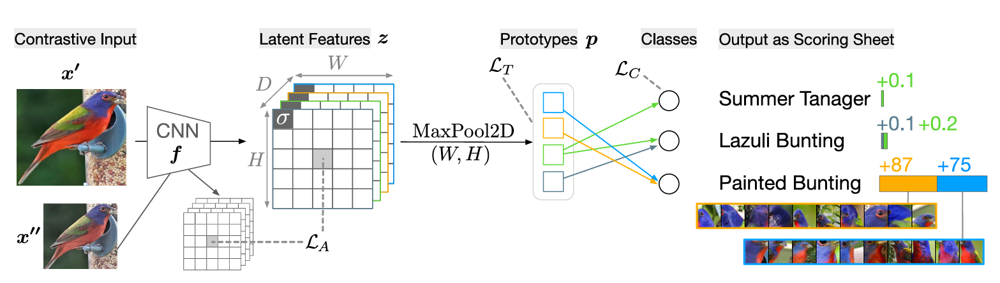

- [[2023-ICCV]](https://openaccess.thecvf.com/content/ICCV2023/papers/Wang_Learning_Support_and_Trivial_Prototypes_for_Interpretable_Image_Classification_ICCV_2023_paper.pdf) **Learning support and trivial prototypes for interpretable image classification**[:octocat:](https://github.com/cwangrun/ST-ProtoPNet)

 Abstract 

<pre>
Prototypical part network (ProtoPNet) methods have been designed to achieve interpretable classification by
associating predictions with a set of training prototypes, which we refer to as trivial prototypes because 
they are trained to lie far from the classification boundary in the feature space. 
Note that it is possible to make an analogy between ProtoPNet and support vector machine (SVM)
given that the classification from both methods relies on computing similarity with a set of training points 
(i.e., trivial prototypes in ProtoPNet, and support vectors in SVM).
However, while trivial prototypes are located far from the classification boundary, support vectors are 
located close to this boundary, and we argue that this discrepancy with the well-established SVM theory 
can result in ProtoPNet models with inferior classification accuracy. 
In this paper, we aim to improve the classification of ProtoPNet with a new method to learn support prototypes 
that lie near the classification boundary in the feature space, as suggested by the SVM theory.
In addition, we target the improvement of classification results with a new model, named ST-ProtoPNet,
which exploits our support prototypes and the trivial prototypes to provide more effective classification. 
Experimental results on CUB-200-2011, Stanford Cars, and Stanford Dogs datasets demonstrate that ST-ProtoPNet 
achieves state-of-the-art classification accuracy and interpretability results. 
We also show that the proposed support prototypes tend to be better localised in the object of interest rather
than in the background region.
</pre>

 Vocabulary 

<pre>
trivial : 微不足道的
analogy : 类比
discrepancy : 差异
inferior : 劣等的
</pre>

<pre>
@inproceedings{wang2023learning,
  title={Learning support and trivial prototypes for interpretable image classification},
  author={Wang, Chong and Liu, Yuyuan and Chen, Yuanhong and Liu, Fengbei and Tian, Yu and McCarthy, Davis and Frazer, Helen and Carneiro, Gustavo},
  booktitle={Proceedings of the IEEE/CVF International Conference on Computer Vision},
  pages={2062--2072},
  year={2023}
}
</pre>

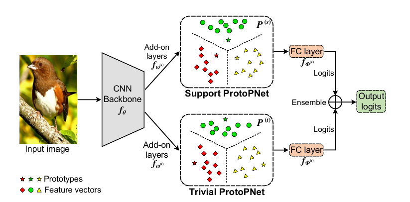

- [[2023-ICCV]](https://openaccess.thecvf.com/content/ICCV2023/papers/Huang_Evaluation_and_Improvement_of_Interpretability_for_Self-Explainable_Part-Prototype_Networks_ICCV_2023_paper.pdf) **Evaluation and improvement of interpretability for self-explainable part-prototype networks** 

 Abstract 

<pre>
Part-prototype networks (e.g., ProtoPNet, ProtoTree, and ProtoPool) have attracted broad research interest 
for their intrinsic interpretability and comparable accuracy to non-interpretable counterparts. 
However, recent works find that the interpretability from prototypes is fragile, due to the semantic gap 
between the similarities in the feature space and that in the input space. 
In this work, we strive to address this challenge by making the first attempt to quantitatively and
objectively evaluate the interpretability of the part-prototype networks. 
Specifically, we propose two evaluation metrics, termed as “consistency score” and “stability score”, 
to evaluate the explanation consistency across images and the explanation robustness against perturbations, 
respectively, both of which are essential for explanations taken into practice. 
Furthermore, we propose an elaborated part-prototype network with a shallow-deep feature alignment (SDFA) 
module and a score aggregation (SA) module to improve the interpretability of prototypes. 
We conduct systematical evaluation experiments and provide substantial discussions to uncover the 
interpretability of existing part-prototype networks. 
Experiments on three benchmarks across nine architectures demonstrate that our model achieves 
significantly superior performance to the state of the art, in both the accuracy and interpretability.
</pre>

 Vocabulary 

<pre>
intrinsic : 内在的
fragile : 脆弱的
strive : 努力的
perturbations : 扰动
uncover : 揭示
</pre>

<pre>
@inproceedings{huang2023evaluation,
  title={Evaluation and improvement of interpretability for self-explainable part-prototype networks},
  author={Huang, Qihan and Xue, Mengqi and Huang, Wenqi and Zhang, Haofei and Song, Jie and Jing, Yongcheng and Song, Mingli},
  booktitle={Proceedings of the IEEE/CVF International Conference on Computer Vision},
  pages={2011--2020},
  year={2023}
}
</pre>

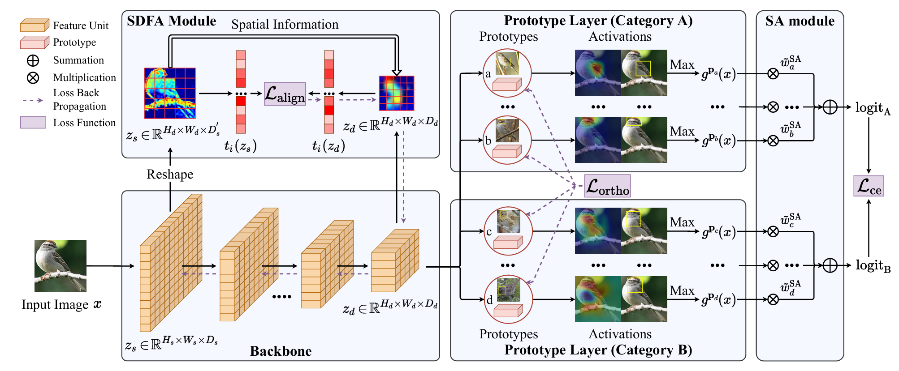

- [[2023-NIPS]](https://proceedings.neurips.cc/paper_files/paper/2023/file/7b76eea0c3683e440c3d362620f578cd-Paper-Conference.pdf) **This looks like those: Illuminating prototypical concepts using multiple visualizations** [:octocat:](https://github.com/Henrymachiyu/This-looks-like-those_ProtoConcepts)

 Abstract 

<pre>
We present ProtoConcepts, a method for interpretable image classification combining deep learning and  
case-based reasoning using prototypical parts. 
Existing work in prototype-based image classification uses a “this looks like that” reasoning process, 
which dissects a test image by finding prototypical parts and combining evidence from these prototypes 
to make a final classification. 
However, all of the existing prototypical part-based image classifiers provide only one-to-one comparisons, 
where a single training image patch serves as a prototype to compare with a part of our test image. 
With these single-image comparisons, it can often be difficult to identify the underlying concept being 
compared (e.g., “is it comparing the color or the shape?”). 
Our proposed method modifies the architecture of prototype-based networks to instead learn prototypical 
concepts which are visualized using multiple image patches. 
Having multiple visualizations of the same prototype allows us to more easily identify the concept captured 
by that prototype (e.g., “the test image and the related training patches are all the same shade of blue”), 
and allows our model to create richer, more interpretable visual explanations. 
Our experiments show that our “this looks like those” reasoning process can be applied as a modification to 
a wide range of existing prototypical image classification networks while achieving comparable accuracy on benchmark datasets.
</pre>

 Vocabulary 

<pre>
dissect : 分解
underlying : 基础的
</pre>

<pre>
@article{ma2023looks,
  title={This looks like those: Illuminating prototypical concepts using multiple visualizations},
  author={Ma, Chiyu and Zhao, Brandon and Chen, Chaofan and Rudin, Cynthia},
  journal={Advances in Neural Information Processing Systems},
  volume={36},
  pages={39212--39235},
  year={2023}
}
</pre>

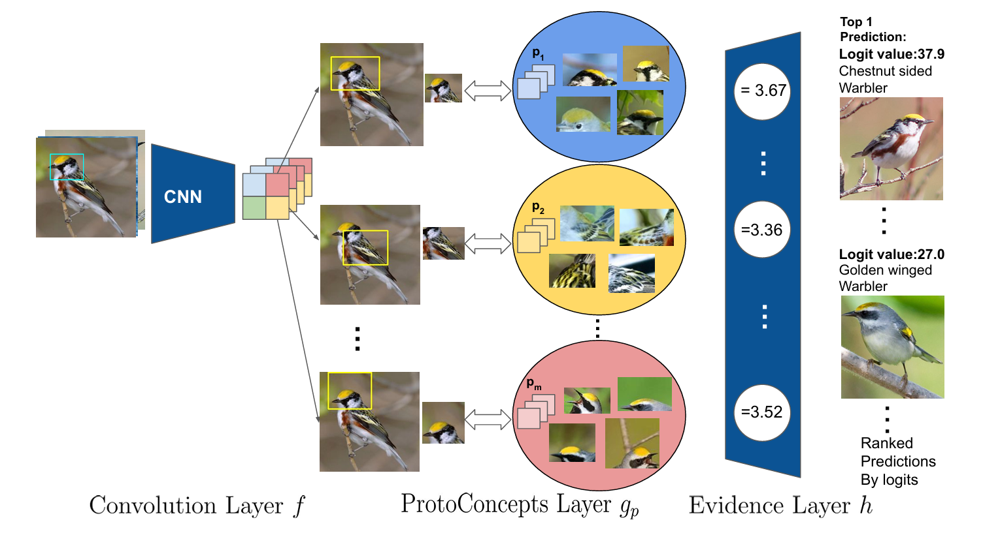

- [[2024-WACV]](https://openaccess.thecvf.com/content/WACV2024/papers/Carmichael_Pixel-Grounded_Prototypical_Part_Networks_WACV_2024_paper.pdf) **Pixel-grounded prototypical part networks** [:octocat:](https://github.com/mpmath/mpmath)

 Abstract 

<pre>
Prototypical part neural networks (ProtoPartNNs), namely PROTOPNET and its derivatives, are an intrinsically
interpretable approach to machine learning. 
Their prototype learning scheme enables intuitive explanations of the form, this (prototype) looks like that 
(testing image patch).
But, does this actually look like that? 
In this work, we delve into why object part localization and associated heat maps in past work are misleading. 
Rather than localizing to object parts, existing ProtoPartNNs localize to the entire image, contrary to 
generated explanatory visualizations. 
We argue that detraction from these underlying issues is due to the alluring nature of visualizations 
and an over-reliance on intuition. 
To alleviate these issues, we devise new receptive field-based architectural constraints for meaningful 
localization and a principled pixel space mapping for ProtoPartNNs. 
To improve interpretability, we propose additional architectural improvements, including a simplified
classification head. 
We also make additional corrections to PROTOPNET and its derivatives, such as the use of a validation 
set, rather than a test set, to evaluate generalization during training. 
Our approach, PIXPNET (Pixel-grounded Prototypical part Network), is the only ProtoPartNN that
truly learns and localizes to prototypical object parts.
We demonstrate that PIXPNET achieves quantifiably improved interpretability without sacrificing accuracy.
</pre>

 Vocabulary 

<pre>
derivatives : 衍生的
intrinsically : 内在的
scheme : 方案
alluring : 吸引人的
intuitive : 直观的
delve : 深入
detraction : 减少
underlying : 基础的
alleviate : 减轻
sacrificing : 牺牲
</pre>

<pre>
@inproceedings{carmichael2024pixel,
  title={Pixel-grounded prototypical part networks},
  author={Carmichael, Zachariah and Lohit, Suhas and Cherian, Anoop and Jones, Michael J and Scheirer, Walter J},
  booktitle={Proceedings of the IEEE/CVF Winter Conference on Applications of Computer Vision},
  pages={4768--4779},
  year={2024}
}
</pre>

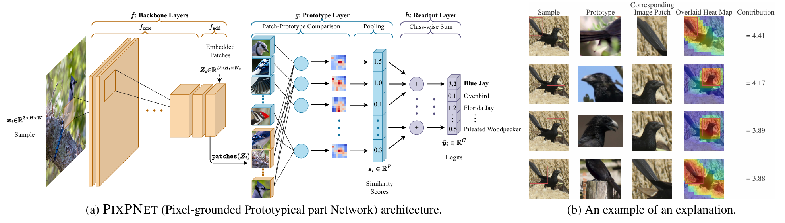

- [[2024-AAAI]](https://ojs.aaai.org/index.php/AAAI/article/view/30154) **Interpretability benchmark for evaluating spatial misalignment of prototypical parts explanations** 

 Abstract 

<pre>
Prototypical parts-based networks are becoming increasingly popular due to their faithful 
self-explanations. 
However, their similarity maps are calculated in the penultimate network layer. 
Therefore, the receptive field of the prototype activation region often depends on parts of the 
image outside this region, which can lead to misleading interpretations. 
We name this undesired behavior a spatial explanation misalignment and introduce an interpretability 
benchmark with a set of dedicated metrics for quantifying this phenomenon. 
In addition, we propose a method for misalignment compensation and apply it to existing 
state-of-the-art models. 
We show the expressiveness of our benchmark and the effectiveness of the proposed compensation 
methodology through extensive empirical studies.
</pre>

 Vocabulary 

<pre>
penultimate : 倒数第二层
undesired : 不想要的
compensation : 补偿
expressiveness : 表达能力
empirical : 经验的
</pre>

<pre>
@inproceedings{sacha2024interpretability,
  title={Interpretability benchmark for evaluating spatial misalignment of prototypical parts explanations},
  author={Sacha, Miko{\l}aj and Jura, Bartosz and Rymarczyk, Dawid and Struski, {\L}ukasz and Tabor, Jacek and Zieli{\'n}ski, Bartosz},
  booktitle={Proceedings of the AAAI Conference on Artificial Intelligence},
  volume={38},
  number={19},
  pages={21563--21573},
  year={2024}
}
</pre>

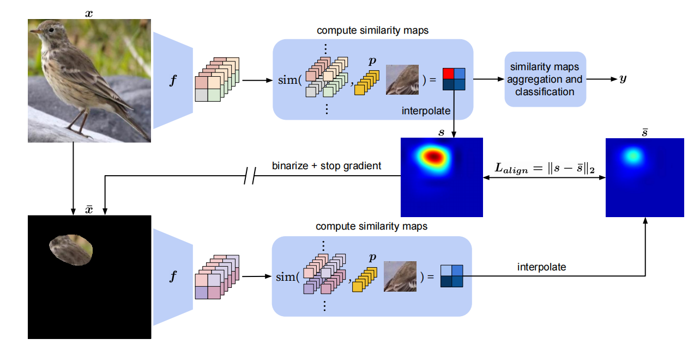

- [[2024-AAAI]](https://ojs.aaai.org/index.php/AAAI/article/view/30109) **On the concept trustworthiness in concept bottleneck models** [:octocat:](https://github.com/hqhQAQ/ProtoCBM)

 Abstract 

<pre>
Concept Bottleneck Models (CBMs), which break down the reasoning process into the input-to-concept 
mapping and the concept-to-label prediction, have garnered signifcant attention due to their remarkable 
interpretability achieved by the interpretable concept bottleneck. 
However, despite the transparency of the concept-to-label prediction, the mapping from the input to 
the intermediate concept remains a black box, giving rise to concerns about the trustworthiness of the
learned concepts (i.e., these concepts may be predicted based on spurious cues). 
The issue of concept untrustworthiness greatly hampers the interpretability of CBMs, thereby hindering 
their further advancement. 
To conduct a comprehensive analysis on this issue, in this study we establish a benchmark
to assess the trustworthiness of concepts in CBMs. 
A pioneering metric, referred to as concept trustworthiness score, is proposed to gauge whether the 
concepts are derived from relevant regions. 
Additionally, an enhanced CBM is introduced, enabling concept predictions to be made specifcally
from distinct parts of the feature map, thereby facilitating the exploration of their related regions. 
Besides, we introduce three modules, namely the cross-layer alignment (CLA) module, the cross-image 
alignment (CIA) module, and the prediction alignment (PA) module, to further enhance the concept 
trustworthiness within the elaborated CBM. 
The experiments on five datasets across ten architectures demonstrate that without using any concept 
localization annotations during training, our model improves the concept trustworthiness by a large margin, 
meanwhile achieving superior accuracy to the state-of-the-arts.
</pre>

 Vocabulary 

<pre>
transparency : 透明度
spurious : 无意义的
hamper : 阻碍
gauge : 测量
derived : 衍生的
margin : 差距
</pre>

<pre>
@inproceedings{huang2024concept,
  title={On the concept trustworthiness in concept bottleneck models},
  author={Huang, Qihan and Song, Jie and Hu, Jingwen and Zhang, Haofei and Wang, Yong and Song, Mingli},
  booktitle={Proceedings of the AAAI Conference on Artificial Intelligence},
  volume={38},
  number={19},
  pages={21161--21168},
  year={2024}
}
</pre>

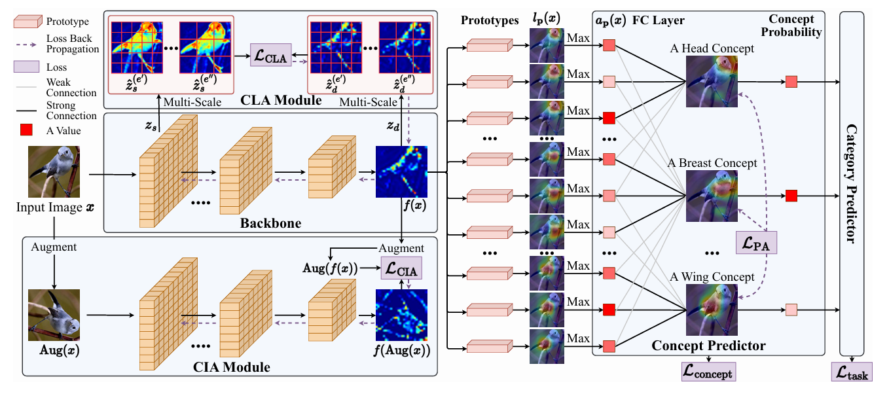

- [[2024-ECCV]](https://arxiv.org/pdf/2407.12200) **This Probably Looks Exactly Like That: An Invertible Prototypical Network** [:octocat:](https://github.com/craymichael/ProtoFlow)

<pre>
@inproceedings{carmichael2024probably,
  title={This probably looks exactly like that: An invertible prototypical network},
  author={Carmichael, Zachariah and Redgrave, Timothy and Cedre, Daniel Gonzalez and Scheirer, Walter J},
  booktitle={European Conference on Computer Vision},
  pages={221--240},
  year={2024},
  organization={Springer}
}
</pre>

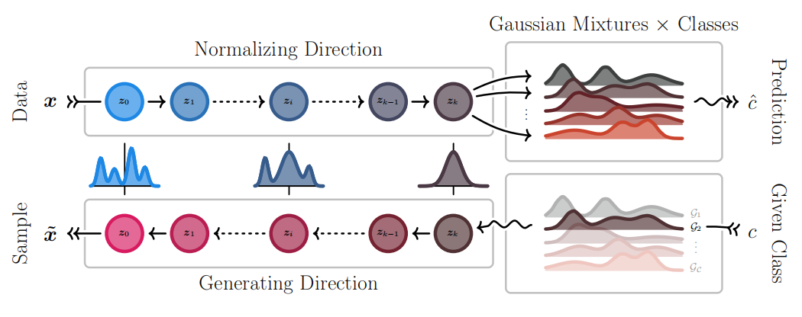

- [[2024-NIPS]](https://proceedings.neurips.cc/paper_files/paper/2024/file/48dfc849640344e2d58df0b5bb78c33b-Paper-Conference.pdf) **Interpretable Image Classification with Adaptive Prototype-based Vision Transformers** [:octocat:](https://github.com/Henrymachiyu/ProtoViT)

<pre>
@inproceedings{ma2024interpretable,
  title={Interpretable Image Classification with Adaptive Prototype-based Vision Transformers},
  author={Ma, Chiyu and Donnelly, Jon and Liu, Wenjun and Vosoughi, Soroush and Rudin, Cynthia and Chen, Chaofan},
  booktitle={The Thirty-eighth Annual Conference on Neural Information Processing Systems},
  year={2024}
}
</pre>

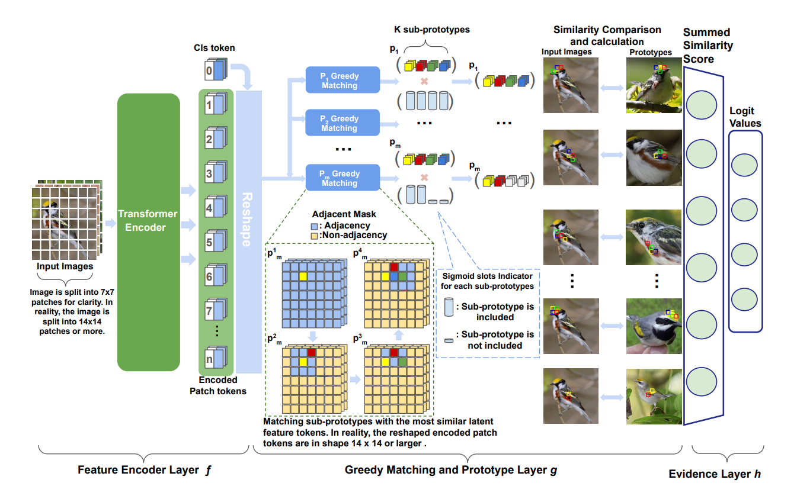

- [[2024-CVPR]](https://openaccess.thecvf.com/content/CVPR2024/papers/Wang_MCPNet_An_Interpretable_Classifier_via_Multi-Level_Concept_Prototypes_CVPR_2024_paper.pdf) **Mcpnet: An interpretable classifier via multi-level concept prototypes** [:octocat:](https://github.com/NVlabs/MCPNet)

<pre>
@inproceedings{wang2024mcpnet,
  title={Mcpnet: An interpretable classifier via multi-level concept prototypes},
  author={Wang, Bor-Shiun and Wang, Chien-Yi and Chiu, Wei-Chen},
  booktitle={Proceedings of the IEEE/CVF Conference on Computer Vision and Pattern Recognition},
  pages={10885--10894},
  year={2024}
}
</pre>

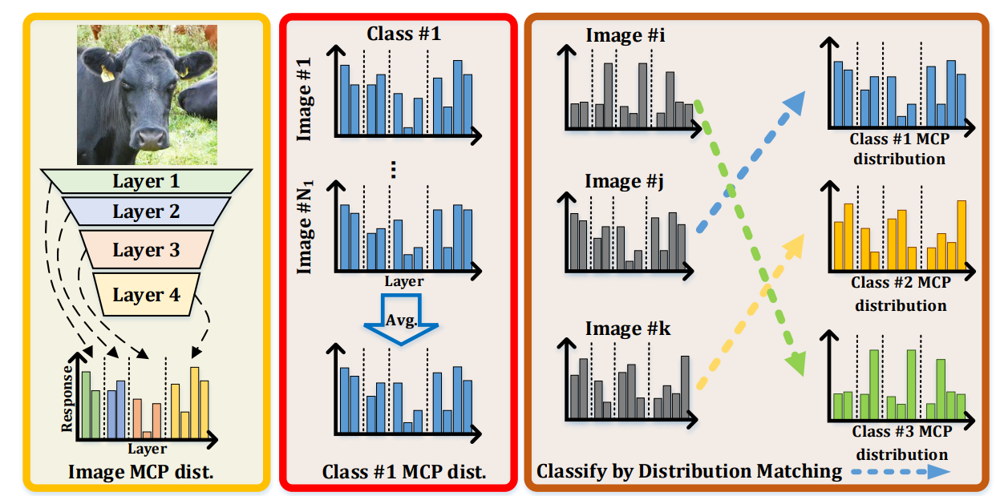

- [[2024-arXiv]](https://arxiv.org/pdf/2406.14675) **This looks better than that: Better interpretable models with protopnext**

<pre>
@article{willard2024looks,
  title={This looks better than that: Better interpretable models with protopnext},
  author={Willard, Frank and Moffett, Luke and Mokel, Emmanuel and Donnelly, Jon and Guo, Stark and Yang, Julia and Kim, Giyoung and Barnett, Alina Jade and Rudin, Cynthia},
  journal={arXiv preprint arXiv:2406.14675},
  year={2024}
}
</pre>

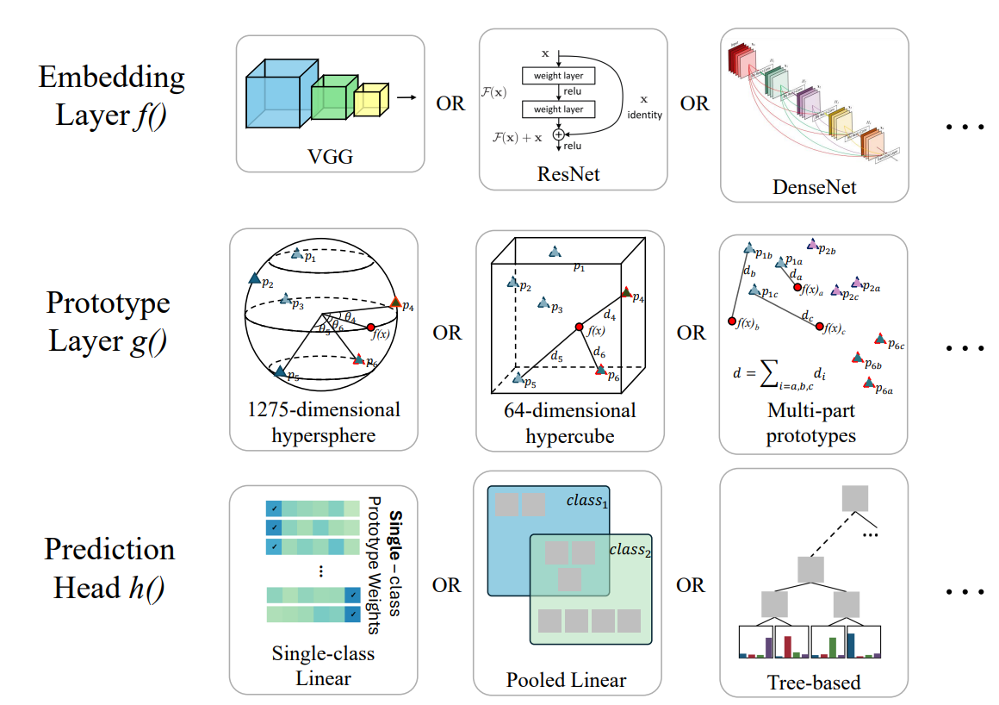

- [[2025-ICASSP]](https://ieeexplore.ieee.org/abstract/document/10890753) **Prototypical Part Transformer for Interpretable Image Recognition**

<pre>
@inproceedings{yu2025prototypical,
  title={Prototypical Part Transformer for Interpretable Image Recognition},
  author={Yu, Anni and Yang, Yu-Bin},
  booktitle={ICASSP 2025-2025 IEEE International Conference on Acoustics, Speech and Signal Processing (ICASSP)},
  pages={1--5},
  year={2025},
  organization={IEEE}
}
</pre>

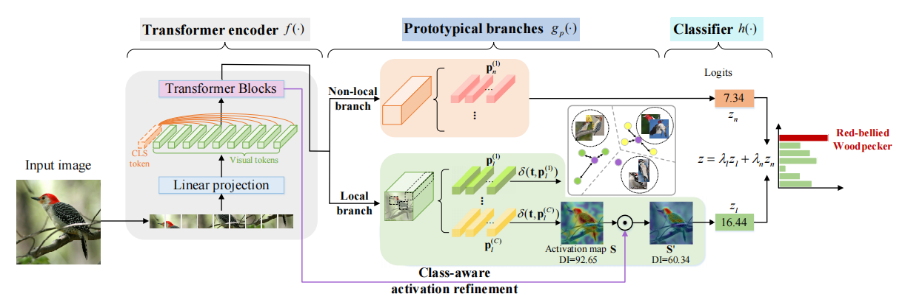

- [[2025-AAAI]](https://ojs.aaai.org/index.php/AAAI/article/view/32173) **ProtoArgNet: Interpretable Image Classification with Super-Prototypes and Argumentation**[:octocat:](https://github.com/H-Ayoobi/ProtoArgNet_AAAI)

<pre>
@inproceedings{ayoobi2025protoargnet,
  title={ProtoArgNet: Interpretable Image Classification with Super-Prototypes and Argumentation},
  author={Ayoobi, Hamed and Potyka, Nico and Toni, Francesca},
  booktitle={Proceedings of the AAAI Conference on Artificial Intelligence},
  volume={39},
  number={2},
  pages={1791--1799},
  year={2025}
}
</pre>

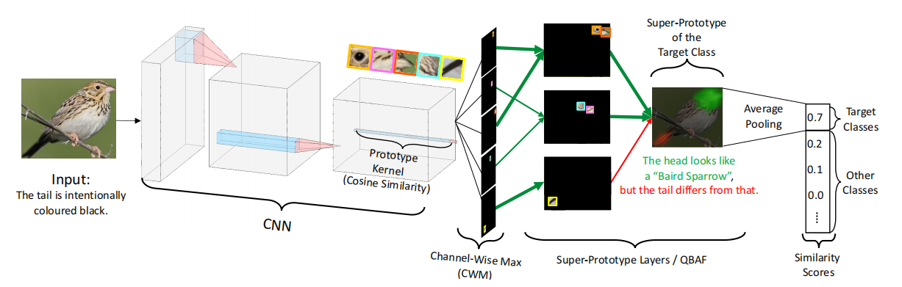

- [[2025-PR]](https://www.sciencedirect.com/science/article/pii/S0031320324006526) **Characteristic discriminative prototype network with detailed interpretation for classification**

<pre>
@article{wen2025characteristic,
  title={Characteristic discriminative prototype network with detailed interpretation for classification},
  author={Wen, Jiajun and Kong, Heng and Lai, Zhihui and Zhu, Zhijie},
  journal={Pattern Recognition},
  volume={157},
  pages={110901},
  year={2025},
  publisher={Elsevier}
}
</pre>

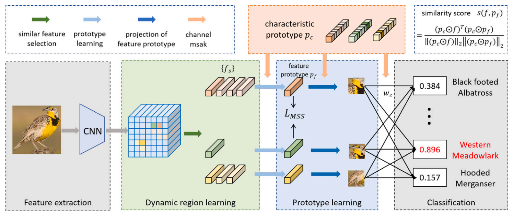

- [[2025-TPAMI]](https://ieeexplore.ieee.org/abstract/document/10982376) **Mixture of gaussian-distributed prototypes with generative modelling for interpretable and trustworthy image recognition**[:octocat:](https://github.com/cwangrun/MGProto)

<pre>
@article{wang2025mixture,
  title={Mixture of gaussian-distributed prototypes with generative modelling for interpretable and trustworthy image recognition},
  author={Wang, Chong and Chen, Yuanhong and Liu, Fengbei and Liu, Yuyuan and McCarthy, Davis James and Frazer, Helen and Carneiro, Gustavo},
  journal={IEEE Transactions on Pattern Analysis and Machine Intelligence},
  year={2025},
  publisher={IEEE}
}
</pre>

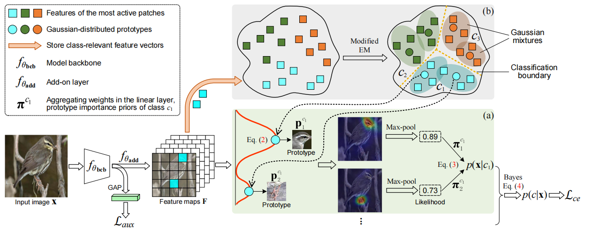

## 🕐 2. Prototype Learning for Medical Image Classification

🕐 (1) Ophthalmology

- [[2022-MICCAI]](https://arxiv.org/pdf/2208.00457) **INSightR-Net: interpretable neural network for regression using similarity-based comparisons to prototypical examples** [:octocat:](https://github.com/lindehesse/INSightR-Net)

<pre>
@inproceedings{hesse2022insightr,
  title={INSightR-Net: interpretable neural network for regression using similarity-based comparisons to prototypical examples},
  author={Hesse, Linde S and Namburete, Ana IL},
  booktitle={International Conference on Medical Image Computing and Computer-Assisted Intervention},
  pages={502--511},
  year={2022},
  organization={Springer}
}
</pre>

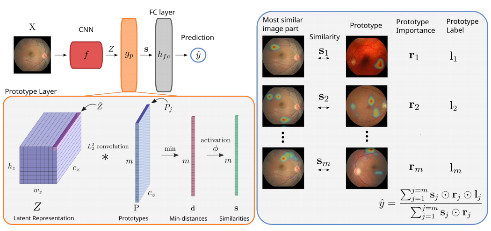

- [[2024-MICCAI]](https://arxiv.org/pdf/2406.15168) **This actually looks like that: Proto-BagNets for local and global interpretability-by-design** [:octocat:](https://github.com/kdjoumessi/Proto-BagNets)

<pre>
@inproceedings{djoumessi2024actually,
  title={This actually looks like that: Proto-BagNets for local and global interpretability-by-design},
  author={Djoumessi, Kerol and Bah, Bubacarr and K{\"u}hlewein, Laura and Berens, Philipp and Koch, Lisa},
  booktitle={International Conference on Medical Image Computing and Computer-Assisted Intervention},
  pages={718--728},
  year={2024},
  organization={Springer}
}
</pre>

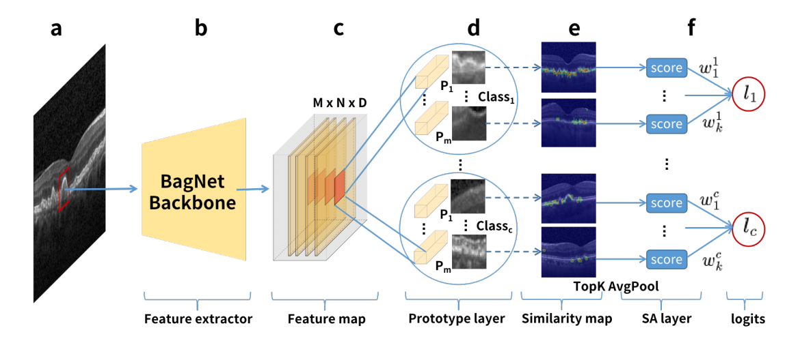

- [[2025-JBHI]](https://ieeexplore.ieee.org/abstract/document/10955117) **Progressive Mining and Dynamic Distillation of Hierarchical Prototypes for Disease Classification and Localisation** [:octocat:](https://github.com/cwangrun/HierProtoPNet)

<pre>
@article{wang2025progressive,
  title={Progressive Mining and Dynamic Distillation of Hierarchical Prototypes for Disease Classification and Localisation},
  author={Wang, Chong and Liu, Fengbei and Chen, Yuanhong and Kwok, Chun Fung and Elliott, Michael and Pena-Solorzano, Carlos and McCarthy, Davis James and Frazer, Helen and Carneiro, Gustavo},
  journal={IEEE Journal of Biomedical and Health Informatics},
  year={2025},
  publisher={IEEE}
}
</pre>

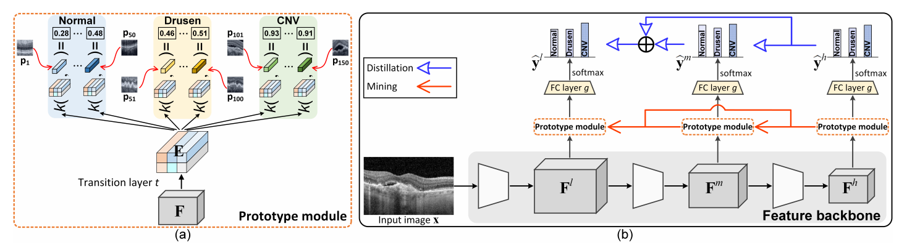

🕐 (2) Cancer

- [[2023-JBHI]](https://ieeexplore.ieee.org/abstract/document/10290723) **Interpretable inference and classification of tissue types in histological colorectal cancer slides based on ensembles adaptive boosting prototype tree** 

<pre>
@article{liang2023interpretable,
  title={Interpretable inference and classification of tissue types in histological colorectal cancer slides based on ensembles adaptive boosting prototype tree},
  author={Liang, Meiyan and Wang, Ru and Liang, Jianan and Wang, Lin and Li, Bo and Jia, Xiaojun and Zhang, Yu and Chen, Qinghui and Zhang, Tianyi and Zhang, Cunlin},
  journal={IEEE Journal of Biomedical and Health Informatics},
  volume={27},
  number={12},
  pages={6006--6017},
  year={2023},
  publisher={IEEE}
}
</pre>

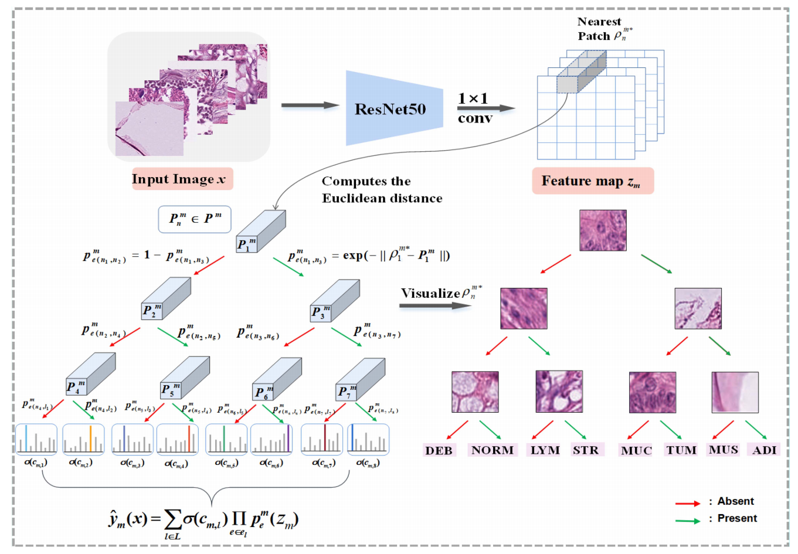

- [[2023-ECAI]](https://arxiv.org/pdf/2307.10404) **Interpreting and correcting medical image classification with pip-net** 

<pre>
@inproceedings{nauta2023interpreting,
  title={Interpreting and correcting medical image classification with pip-net},
  author={Nauta, Meike and Hegeman, Johannes H and Geerdink, Jeroen and Schl{\"o}tterer, J{\"o}rg and Keulen, Maurice van and Seifert, Christin},
  booktitle={European Conference on Artificial Intelligence},
  pages={198--215},
  year={2023},
  organization={Springer}
}
</pre>

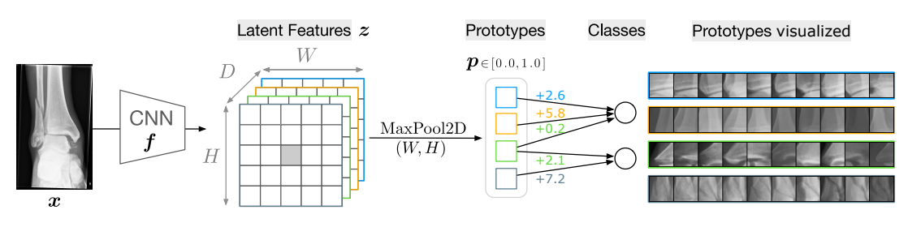

- [[2023-TMI]](https://ieeexplore.ieee.org/abstract/document/10225391) **An Interpretable and Accurate Deep-Learning Diagnosis Framework Modeled With Fully and Semi-Supervised Reciprocal Learning** [:octocat:](https://github.com/sendyma/Medical-XAI)

<pre>
@article{wang2023interpretable,
  title={An Interpretable and Accurate Deep-Learning Diagnosis Framework Modeled With Fully and Semi-Supervised Reciprocal Learning},
  author={Wang, Chong and Chen, Yuanhong and Liu, Fengbei and Elliott, Michael and Kwok, Chun Fung and Pena-Solorzano, Carlos and Frazer, Helen and McCarthy, Davis James and Carneiro, Gustavo},
  journal={IEEE transactions on medical imaging},
  volume={43},
  number={1},
  pages={392--404},
  year={2023},
  publisher={IEEE}
}
</pre>

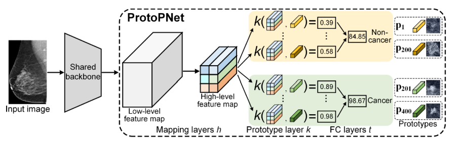

- [[2023-MICCAI]](https://arxiv.org/pdf/2310.15741) **Interpretable medical image classification using prototype learning and privileged information** [:octocat:](https://github.com/XRad-Ulm/Proto-Caps)

<pre>
@inproceedings{gallee2023interpretable,
  title={Interpretable medical image classification using prototype learning and privileged information},
  author={Gall{\'e}e, Luisa and Beer, Meinrad and G{\"o}tz, Michael},
  booktitle={International Conference on Medical Image Computing and Computer-Assisted Intervention},
  pages={435--445},
  year={2023},
  organization={Springer}
}
</pre>

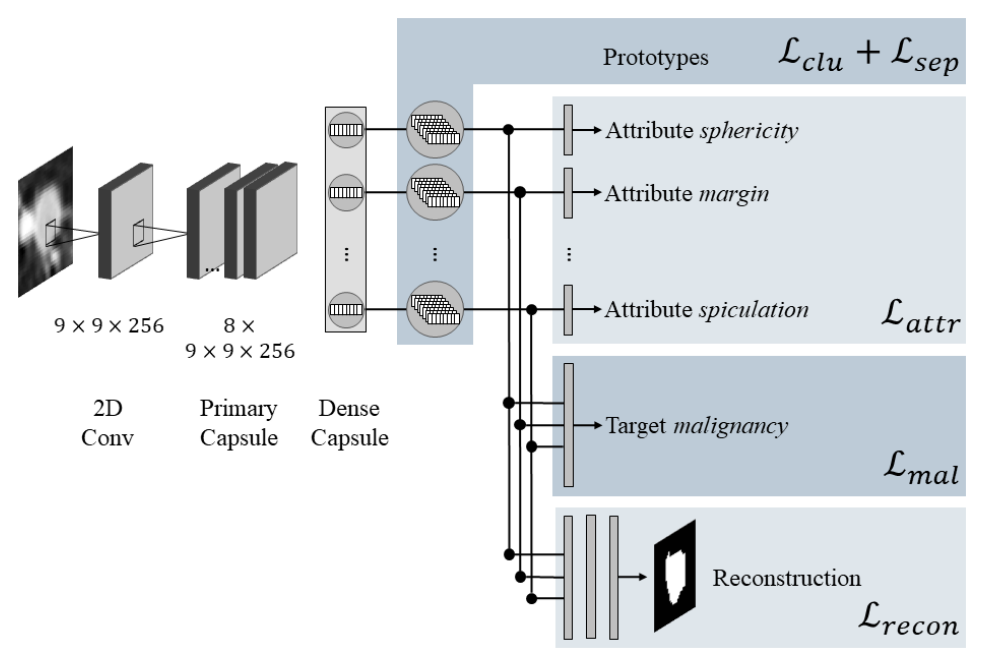

- [[2024-MICCAI]](https://papers.miccai.org/miccai-2024/paper/1022_paper.pdf) **Pamil: Prototype attention-based multiple instance learning for whole slide image classification** [:octocat:](https://github.com/Jiashuai-Liu/PAMIL)

<pre>
@inproceedings{liu2024pamil,
  title={Pamil: Prototype attention-based multiple instance learning for whole slide image classification},
  author={Liu, Jiashuai and Mao, Anyu and Niu, Yi and Zhang, Xianli and Gong, Tieliang and Li, Chen and Gao, Zeyu},
  booktitle={International Conference on Medical Image Computing and Computer-Assisted Intervention},
  pages={362--372},
  year={2024},
  organization={Springer}
}
</pre>

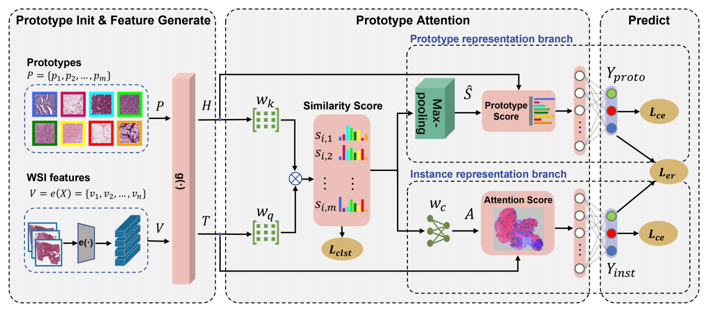

- [[2024-arXiv]](https://arxiv.org/pdf/2402.01410) **XAI for Skin Cancer Detection with Prototypes and Non-Expert Supervision** [:octocat:](https://github.com/MiguelC23/XAI-Skin-Cancer-Detection-A-Prototype-Based-Deep-Learning-Architecture-with-Non-Expert-Supervision)

<pre>
@article{correia2024xai,
  title={XAI for Skin Cancer Detection with Prototypes and Non-Expert Supervision},
  author={Correia, Miguel and Bissoto, Alceu and Santiago, Carlos and Barata, Catarina},
  journal={arXiv preprint arXiv:2402.01410},
  year={2024}
}
</pre>

🕐 (3) Alzheimer’s disease detection
- [[2023-NeuroImage]](https://www.sciencedirect.com/science/article/pii/S1053811923002197) **Estimating explainable Alzheimer's disease likelihood map via clinically-guided prototype learning** [:octocat:](https://github.com/ku-milab/XADLiME)

<pre>
@article{mulyadi2023estimating,
  title={Estimating explainable Alzheimer’s disease likelihood map via clinically-guided prototype learning},
  author={Mulyadi, Ahmad Wisnu and Jung, Wonsik and Oh, Kwanseok and Yoon, Jee Seok and Lee, Kun Ho and Suk, Heung-Il},
  journal={NeuroImage},
  volume={273},
  pages={120073},
  year={2023},
  publisher={Elsevier}
}
</pre>

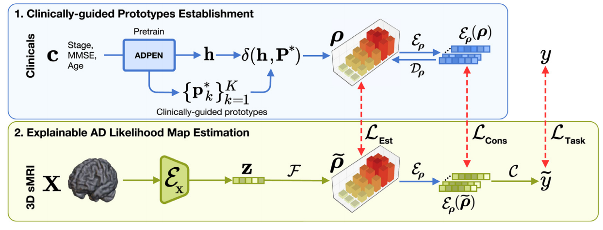

- [[2023-IPMI]](https://arxiv.org/pdf/2303.07125) **Don't panic: Prototypical additive neural network for interpretable classification of alzheimer's disease** [:octocat:](https://github.com/ai-med/PANIC)

<pre>
@inproceedings{wolf2023don,
  title={Don’t panic: Prototypical additive neural network for interpretable classification of alzheimer’s disease},
  author={Wolf, Tom Nuno and P{\"o}lsterl, Sebastian and Wachinger, Christian},
  booktitle={International Conference on Information Processing in Medical Imaging},
  pages={82--94},
  year={2023},
  organization={Springer}
}
</pre>

- [[2024-MICCAI]](https://arxiv.org/pdf/2403.18328) **Pipnet3d: Interpretable detection of alzheimer in mri scans** 
<pre>
@inproceedings{de2024pipnet3d,
  title={Pipnet3d: Interpretable detection of alzheimer in mri scans},
  author={De Santi, Lisa Anita and Schl{\"o}tterer, J{\"o}rg and Scheschenja, Michael and Wessendorf, Joel and Nauta, Meike and Positano, Vincenzo and Seifert, Christin},
  booktitle={International Conference on Medical Image Computing and Computer-Assisted Intervention},
  pages={69--78},
  year={2024},
  organization={Springer}
}
</pre>

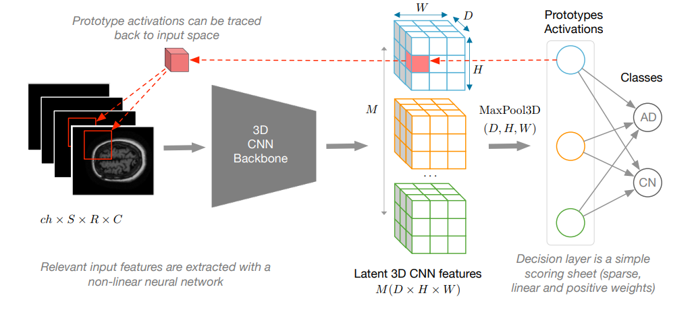

🕐 (4) Mammography

- [[2021-nature machine intelligence]](https://arxiv.org/pdf/2103.12308) **A case-based interpretable deep learning model for classification of mass lesions in digital mammography** [:octocat:](https://github.com/alinajadebarnett/iaiabl)

<pre>
@article{barnett2021case,
  title={A case-based interpretable deep learning model for classification of mass lesions in digital mammography},
  author={Barnett, Alina Jade and Schwartz, Fides Regina and Tao, Chaofan and Chen, Chaofan and Ren, Yinhao and Lo, Joseph Y and Rudin, Cynthia},
  journal={Nature Machine Intelligence},
  volume={3},
  number={12},
  pages={1061--1070},
  year={2021},
  publisher={Nature Publishing Group UK London}
}
</pre>

- [[2022-MICCAI]](https://arxiv.org/pdf/2209.12420) **Knowledge distillation to ensemble global and interpretable prototype-based mammogram classification models** 

<pre>
@inproceedings{wang2022knowledge,
  title={Knowledge distillation to ensemble global and interpretable prototype-based mammogram classification models},
  author={Wang, Chong and Chen, Yuanhong and Liu, Yuyuan and Tian, Yu and Liu, Fengbei and McCarthy, Davis J and Elliott, Michael and Frazer, Helen and Carneiro, Gustavo},
  booktitle={International Conference on Medical Image Computing and Computer-Assisted Intervention},
  pages={14--24},
  year={2022},
  organization={Springer}
}
</pre>

- [[2024-CVPR Workshop]](https://openaccess.thecvf.com/content/CVPR2024W/DEF-AI-MIA/papers/Yang_FPN-IAIA-BL_A_Multi-Scale_Interpretable_Deep_Learning_Model_for_Classification_of_CVPRW_2024_paper.pdf) **FPN-IAIA-BL: A Multi-Scale Interpretable Deep Learning Model for Classification of Mass Margins in Digital Mammography** 

<pre>
@inproceedings{yang2024fpn,
  title={FPN-IAIA-BL: A Multi-Scale Interpretable Deep Learning Model for Classification of Mass Margins in Digital Mammography},
  author={Yang, Julia and Barnett, Alina Jade and Donnelly, Jon and Kishore, Satvik and Fang, Jerry and Schwartz, Fides Regina and Chen, Chaofan and Lo, Joseph Y and Rudin, Cynthia},
  booktitle={Proceedings of the IEEE/CVF Conference on Computer Vision and Pattern Recognition},
  pages={5003--5009},
  year={2024}
}
</pre>

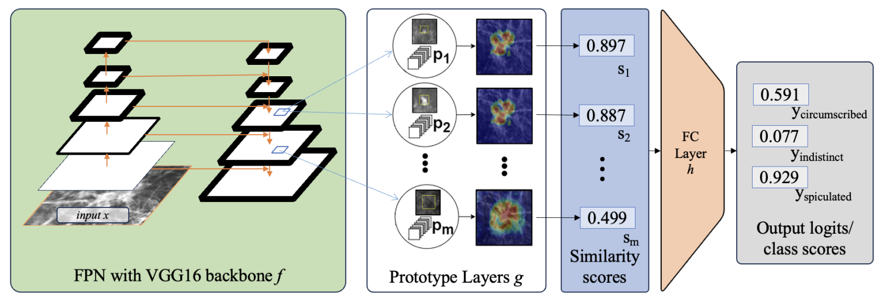

🕐 (5) Chest X-ray

- [[2021-CVPR]](https://openaccess.thecvf.com/content/CVPR2021/papers/Kim_XProtoNet_Diagnosis_in_Chest_Radiography_With_Global_and_Local_Explanations_CVPR_2021_paper.pdf) **XProtoNet: diagnosis in chest radiography with global and local explanations** 

<pre>
@inproceedings{kim2021xprotonet,
  title={XProtoNet: diagnosis in chest radiography with global and local explanations},
  author={Kim, Eunji and Kim, Siwon and Seo, Minji and Yoon, Sungroh},
  booktitle={Proceedings of the IEEE/CVF conference on computer vision and pattern recognition},
  pages={15719--15728},
  year={2021}
}
</pre>

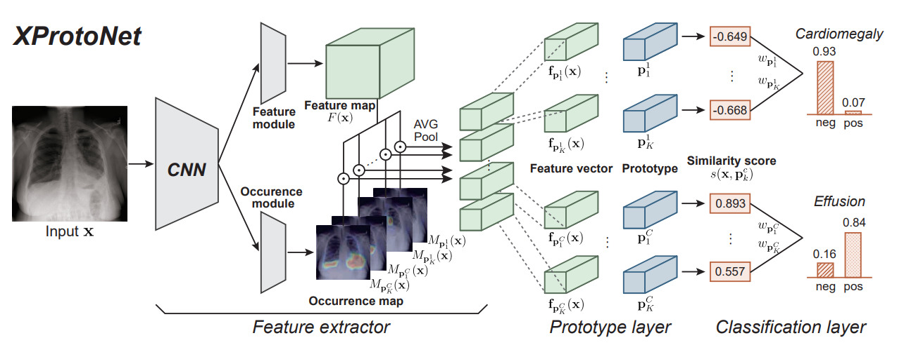

- [[2024-ISBI]](https://ieeexplore.ieee.org/abstract/document/10635182) **Explainable transformer prototypes for medical diagnoses** [:octocat:](http://www.github.com/NUBagcilab/r2r_proto)

<pre>
@inproceedings{demir2024explainable,
  title={Explainable transformer prototypes for medical diagnoses},
  author={Demir, Ugur and Jha, Debesh and Zhang, Zheyuan and Keles, Elif and Allen, Bradley and Katsaggelos, Aggelos K and Bagci, Ulas},
  booktitle={2024 IEEE International Symposium on Biomedical Imaging (ISBI)},
  pages={1--5},
  year={2024},
  organization={IEEE}
}
</pre>

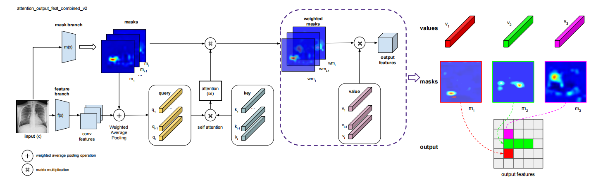

- [[2025-TMI]](https://ieeexplore.ieee.org/abstract/document/10887396) **Cross-and Intra-image Prototypical Learning for Multi-label Disease Diagnosis and Interpretation** [:octocat:](https://github.com/cwangrun/CIPL)

<pre>
@article{wang2025cross,
  title={Cross-and Intra-image Prototypical Learning for Multi-label Disease Diagnosis and Interpretation},
  author={Wang, Chong and Liu, Fengbei and Chen, Yuanhong and Frazer, Helen and Carneiro, Gustavo},
  journal={IEEE Transactions on Medical Imaging},
  year={2025},
  publisher={IEEE}
}
</pre>

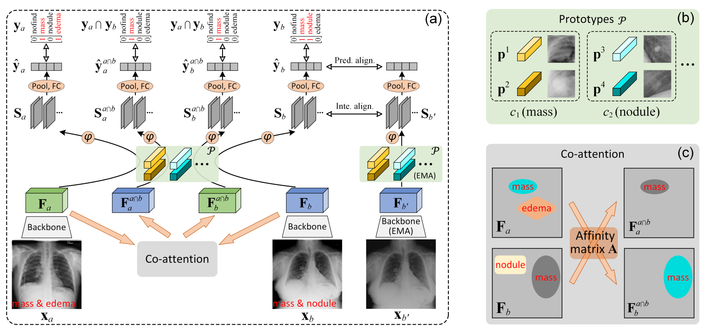

🕐 (6) Echocardiography

- [[2023-MICCAI]](https://arxiv.org/pdf/2307.14433) **Protoasnet: Dynamic prototypes for inherently interpretable and uncertainty-aware aortic stenosis classification in echocardiography** [:octocat:](https://github.com/hooman007/ProtoASNet)

<pre>
@inproceedings{vaseli2023protoasnet,
  title={Protoasnet: Dynamic prototypes for inherently interpretable and uncertainty-aware aortic stenosis classification in echocardiography},
  author={Vaseli, Hooman and Gu, Ang Nan and Ahmadi Amiri, S Neda and Tsang, Michael Y and Fung, Andrea and Kondori, Nima and Saadat, Armin and Abolmaesumi, Purang and Tsang, Teresa SM},
  booktitle={International conference on medical image computing and computer-assisted intervention},
  pages={368--378},
  year={2023},
  organization={Springer}
}
</pre>

- [[2025-MedIA]](https://www.sciencedirect.com/science/article/pii/S1361841525001471) **ProtoASNet: Comprehensive evaluation and enhanced performance with uncertainty estimation for Aortic stenosis classification in echocardiography** [:octocat:](https://github.com/hooman007/ProtoASNet)

<pre>
@article{gu2025protoasnet,
  title={ProtoASNet: Comprehensive evaluation and enhanced performance with uncertainty estimation for Aortic stenosis classification in echocardiography},
  author={Gu, Ang Nan and Vaseli, Hooman and Tsang, Michael Y and Wu, Victoria and Amiri, S Neda Ahmadi and Kondori, Nima and Fung, Andrea and Tsang, Teresa SM and Abolmaesumi, Purang},
  journal={Medical Image Analysis},
  pages={103600},
  year={2025},
  publisher={Elsevier}
}
</pre>

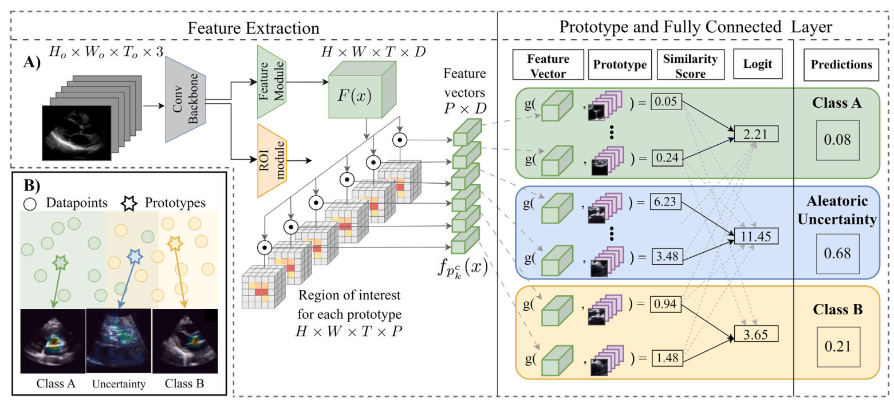

🕐 (7) COVID-19

- [[2022-NN]](https://www.sciencedirect.com/science/article/pii/S0893608022001125) **Think positive: An interpretable neural network for image recognition** 

<pre>
@article{singh2022think,
  title={Think positive: An interpretable neural network for image recognition},
  author={Singh, Gurmail},
  journal={Neural Networks},
  volume={151},
  pages={178--189},
  year={2022},
  publisher={Elsevier}
}
</pre>

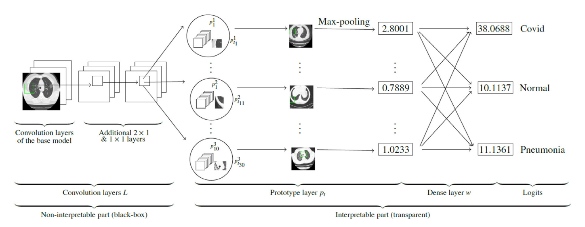

🕐 (8) Heart disease

- [[2025-MIA]](https://www.sciencedirect.com/science/article/pii/S1361841525000854) **Graph-based prototype inverse-projection for identifying cortical sulcal pattern abnormalities in congenital heart disease** [:octocat:](https://github.com/hookhy/surfacepip)

<pre>
@article{kwon2025graph,
  title={Graph-based prototype inverse-projection for identifying cortical sulcal pattern abnormalities in congenital heart disease},
  author={Kwon, Hyeokjin and Son, Seungyeon and Morton, Sarah U and Wypij, David and Cleveland, John and Rollins, Caitlin K and Huang, Hao and Goldmuntz, Elizabeth and Panigrahy, Ashok and Thomas, Nina H and others},
  journal={Medical Image Analysis},
  volume={102},
  pages={103538},
  year={2025},
  publisher={Elsevier}
}
</pre>

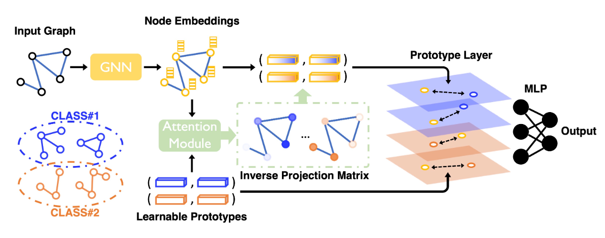

🕐 (9) Brain tumor

- [[2024-MIDL]](https://proceedings.mlr.press/v227/wei24a/wei24a.pdf) **Mprotonet: A case-based interpretable model for brain tumor classification with 3d multi-parametric magnetic resonance imaging** [:octocat:](https://github.com/aywi/mprotonet)

<pre>
@inproceedings{wei2024mprotonet,
  title={Mprotonet: A case-based interpretable model for brain tumor classification with 3d multi-parametric magnetic resonance imaging},
  author={Wei, Yuanyuan and Tam, Roger and Tang, Xiaoying},
  booktitle={Medical Imaging with Deep Learning},
  pages={1798--1812},
  year={2024},
  organization={PMLR}
}
</pre>

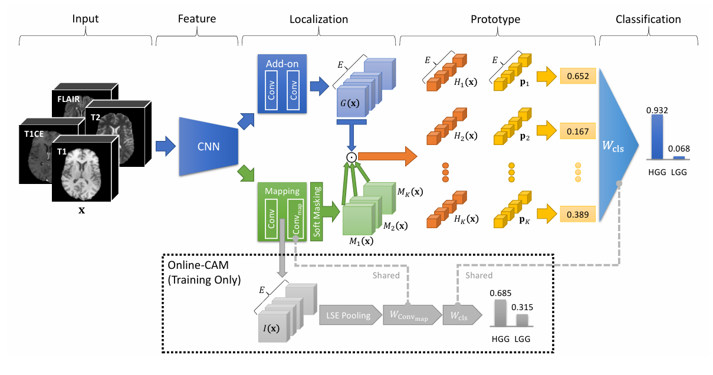

🕐 (10) Cephalometric

- [[2024-MICCAI]](https://arxiv.org/pdf/2406.12577) **Cephalometric landmark detection across ages with prototypical network** [:octocat:](https://github.com/ShanghaiTech-IMPACT/CeLDA/)

<pre>
@inproceedings{wu2024cephalometric,
  title={Cephalometric landmark detection across ages with prototypical network},
  author={Wu, Han and Wang, Chong and Mei, Lanzhuju and Yang, Tong and Zhu, Min and Shen, Dinggang and Cui, Zhiming},
  booktitle={International Conference on Medical Image Computing and Computer-Assisted Intervention},
  pages={155--165},
  year={2024},
  organization={Springer}
}
</pre>

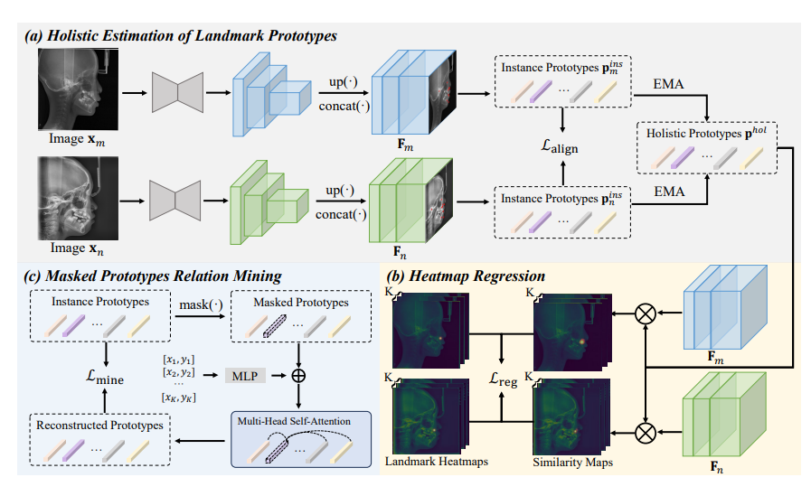

🕐 (11) Others

- [[2024-TMI]](https://ieeexplore.ieee.org/abstract/document/10378976) **A test statistic estimation-based approach for establishing self-interpretable cnn-based binary classifiers** 

<pre>
@article{sengupta2024test,
  title={A test statistic estimation-based approach for establishing self-interpretable cnn-based binary classifiers},
  author={Sengupta, Sourya and Anastasio, Mark A},
  journal={IEEE transactions on medical imaging},
  volume={43},
  number={5},
  pages={1753--1765},
  year={2024},
  publisher={IEEE}
}
</pre>

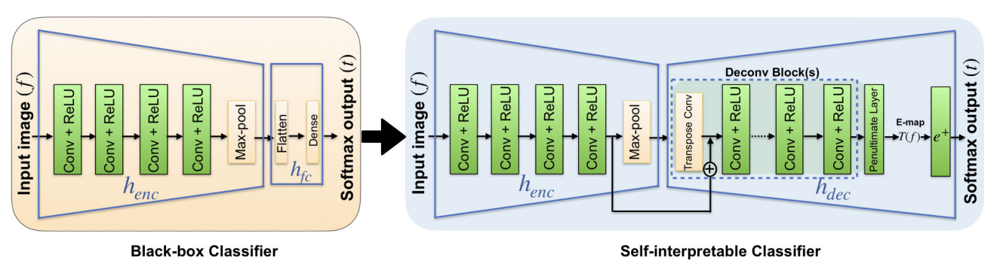

- [[2025-JBHI]](https://ieeexplore.ieee.org/abstract/document/10856378) **FeaInfNet: Diagnosis of Medical Images with Feature-Driven Inference and Visual Explanations** 

<pre>
@article{peng2025feainfnet,
  title={FeaInfNet: Diagnosis of Medical Images with Feature-Driven Inference and Visual Explanations},
  author={Peng, Yitao and He, Lianghua and Hu, Die and Liu, Yihang and Yang, Longzhen and Shang, Shaohua},
  journal={IEEE Journal of Biomedical and Health Informatics},
  year={2025},
  publisher={IEEE}
}
</pre>

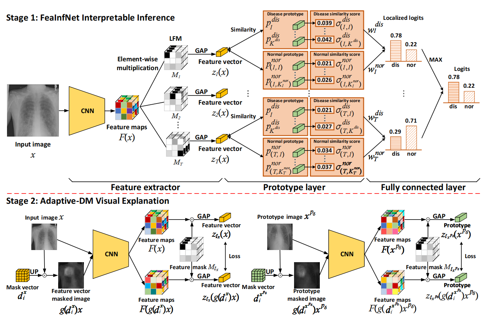

## 🥰 Star History

